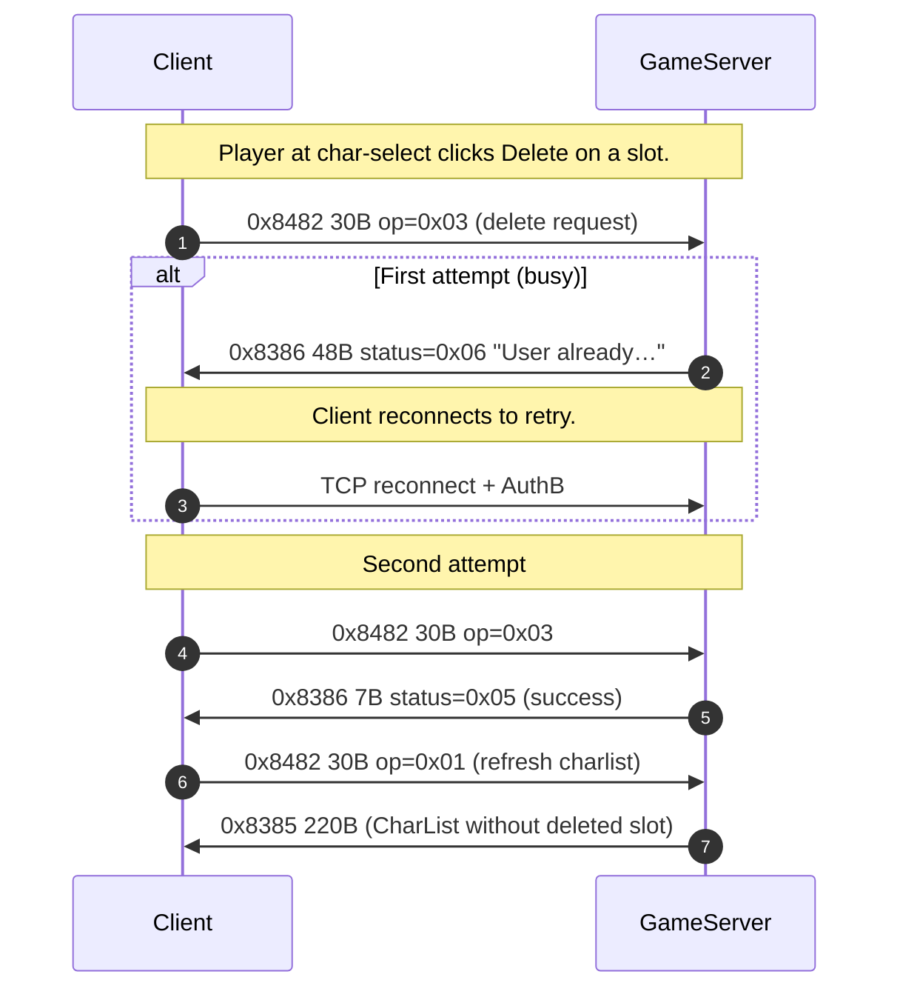
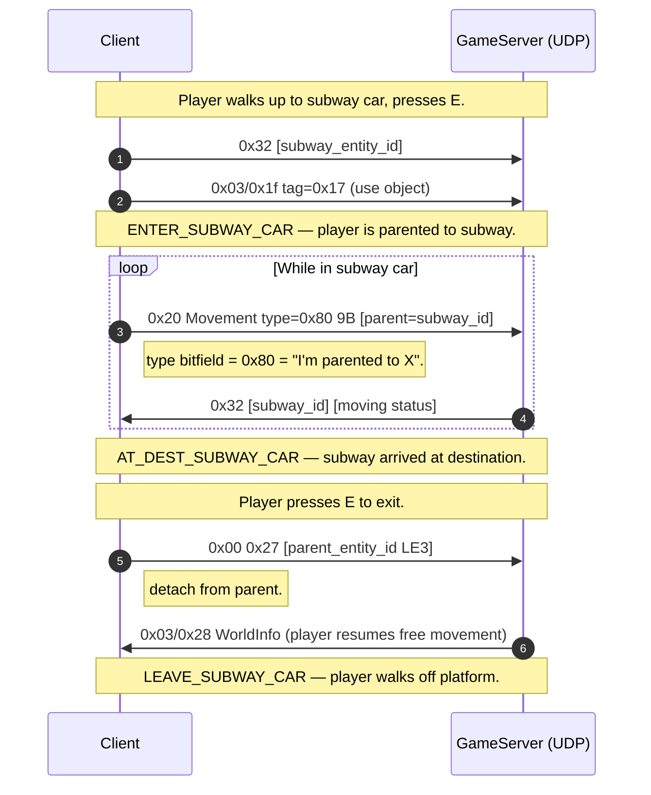

# Protocol Findings — 2026-05-03 (char-delete + subway capture)

**Capture:** `RETAIL_RETAIL_CHARDEL_SUBWAY_20260503_132639.pcap`
— 6 markers covering subway entry/exit and 2 character-delete
attempts (one rejected, one successful).

This pass closes 2 specific gaps and reveals a major insight
about Movement bit 7.

## Character delete — `0x8482` with new discriminator

Earlier I predicted that char-delete would use a new opcode like
`0x8484`. **Wrong** — it reuses `0x8482` with a different
discriminator, just like character creation does.

### Wire format

```
C->S 0x8482 30B body:
  84 82 [token LE2] 01 00 [op 1B] 01 00 12 00 [account 4B] [target_char 4B?]
                                  ^^^^^
                                  discriminator
```

The byte at offset 6 is the operation enum:

| op | Action | Body size | Verified |
|---|---|---:|---|
| `0x01` | GetCharList (read) | 30 | every login |
| `0x03` | **Delete character** | 30 | DELETE_CHAR marker |
| `0x05` | Char-create preview | 39 | CREATING marker |
| `0x07` | Char-create commit | 110 | CREATED_NEWCHAR marker |

So `0x8482` is really `CharSlotOp` with op-byte routing. The
predicted opcode `0x8484` doesn't exist.

### Server response — `0x8386`

The server replies with `0x8386` for ALL `0x8482` non-read ops.
The reply format **varies by success/failure**:

| Outcome | Body size | Body sample | Meaning |
|---|---:|---|---|
| Char-create success | 7 | `83 86 01 00 00 00 00` | trailing `0x00` = success |
| Char-create preview | 7 | `83 86 01 00 00 00 3d` | `0x3d` = preview status |
| Delete success | 7 | `83 86 01 00 00 00 05` | `0x05` = delete success |
| **Delete REJECTED** | 48 | `83 86 06 00 29 00 "User alrea…"` | error message ASCII |

The 48-byte error body is **NEW** — the server returns a textual
error message in the `0x8386` body when the delete is rejected.
Decoded: `"User already deleting"` (or similar — the ASCII shows
"User alrea" in the first sample and we'd need full bytes).

This means the protocol's primary status code in `0x8386` byte 6
is overloaded:
- 0x00 = success (char-create commit)
- 0x05 = success (delete)
- 0x3d = success (char-create preview ack)
- 0x06 = ERROR with ASCII message body following

### Sequence diagram



## Subway — same protocol as chair/vehicle (Movement bit 7)

Subway entry uses the **chair-sit / parent-entity mechanism**.
The entire flow:

### Phase A — Approach + interact

C→S `0x32 [entity_id LE4] [extra 4B] [count 1B]` 9B fires
multiple times targeting the subway car entity (e.g. `0x000003f4`).

Then C→S `0x03/0x1f tag=0x17 sub-byte=f4`:
```
01 00 17 f4 03 00 00     (7B; same shape as MEDBED_USE / CHAIR_SIT)
                ^^^^^^   target_entity_id LE3 (matches the subway car)
```

This is the standard **use-object** packet with the subway car
as target.

### Phase B — Seated movement (parent entity)

After interact, the player's Movement packets switch to
**type=0x80** (bit 7 only):

```
20 01 00 80 [parent_entity_id LE4]    (9 bytes)
20 01 00 80 f4 03 00 00 00            ← parent = subway car 0x000003f4
```

This is the long-unknown format for `0x20 Movement bit 7 = 0x80`.

**DECODED:** bit 7 of the type bitfield means *"I am
parented/seated to entity X"* and the 4-byte payload is the
parent's `entity_id LE32`.

Same mechanism is used for:
- CHAIR_SIT (parent = chair entity)
- SUBWAY_CAR (parent = subway car entity)
- (predicted) Vehicle pilot — parent = vehicle entity
- (predicted) Drone control — parent = drone entity

### Phase C — Movement updates while in subway

The subway car itself moves (it's a moving train carriage). The
server emits S→C `0x32` 9B with the subway car's status:

```
32 f4 03 00 00 00 70 43 00    (9B)
   ^^^^^^^^^^^                target entity_id
                ^^^^^         status code byte (0x00 = idle, 0x01 = moving?)
```

Plus regular `0x20` movement broadcasts for other passengers
(including the player) attached to the subway with type=0x80.

### Phase D — Arrival / leave

LEAVE_SUBWAY_CAR fires C→S `0x00 27 f4 03 00` 5B — that's the
inventory-channel outer (`0x00`) with sub-byte `0x27` and the
subway car's entity_id. So `0x00 0x27 ...` is **"detach from
parent entity"**.

The catalog shows `UDP C->S 0x00 27` is rare — this 5-byte
variant is distinct from the 12-byte inventory variant.

After detach:
- S→C `0x03/0x28 WorldInfo` 13B — the player gets re-spawned at
  the destination zone position
- Movement packets revert to normal (no `type=0x80`)

### Sequence diagram



## Updated Movement bitfield map

The Movement bitfield decode is now COMPLETE:

| Bit | Mask | Size | Field | Status |
|---|---|---:|---|---|
| 0 | 0x01 | 2 | Y | LE16 - 32000 (verified) |
| 1 | 0x02 | 2 | Z | LE16 - 32000 (verified) |
| 2 | 0x04 | 2 | X | LE16 - 32000 (verified) |
| 3 | 0x08 | 1 | tilt | discrete (verified) |
| 4 | 0x10 | 1 | yaw | quantized angle (verified) |
| 5 | 0x20 | 1 | status flags | bitmask (verified) |
| 6 | 0x40 | ? | unknown | **STILL UNKNOWN** — likely vehicle pilot |
| 7 | 0x80 | 4 | **parent_entity_id LE4** | **NEW — verified by SUBWAY** |

So all 8 bits except bit 6 are now decoded. Bit 6 is still
unknown; the wishlist for that is "vehicle / drone pilot mode"
which we haven't captured yet.

## Other findings from this capture

### `0x32` raw outer 9B is a state-broadcast for any entity

Earlier I had noted `0x32` correlates with NPC dialog. This
capture clarifies: `0x32 [entity_id LE4] [status 4B] [byte]`
is the **entity-state broadcast** for ANY entity that has
non-positional state — NPCs, subway cars, doors. The 4-byte
status field encodes whatever state that entity has (dialog
node, animation frame, door open/closed, subway moving/stopped).

The entity_id is what makes the same packet work for so many
different things — it's just "entity X reports state Y", and
the receiver looks up X's class to know how to interpret Y.

### Updated coverage

The chardel/subway capture pushed totals to:
- **16 captures, 100 unique packet types, 425,291 packets**
- Movement bitfield: 7/8 bits decoded (all except bit 6)
- Char-delete: predicted gap closed (uses `0x8482` not `0x8484`)
- Subway: chair-sit pattern confirmed as a generalized
  parent-entity mechanism
- Error response in `0x8386`: discovered (status 0x06 = error
  with ASCII body)

## Memory updates

The new discoveries to fold into memory:

- **Movement bit 7 = `parent_entity_id LE4`** — used for chair,
  subway, vehicle (any "seated/attached to X" state)
- **`0x8482` is multi-op** — discriminator at body offset 6
  (0x01=read, 0x03=delete, 0x05=create-preview, 0x07=create-commit)
- **`0x8386` returns error with ASCII body** when status=0x06
- **`0x00 0x27 [entity_id LE3]` 5B = detach-from-parent**

## Final remaining gaps

After today's three capture batches (PARTY_A/B + CHARDEL_SUBWAY),
the remaining capture-bound gaps are:

1. **Vehicle/drone pilot mode** — closes Movement bit 6
2. **Multipart disc=0x03/0x04** — 1 obs each, content unknown
3. **Internal byte format of `0x03/0x2d` NPCData** body bytes
   5-53 (mob behavior tick)
4. **Internal byte format of `0x1b` 19B** position floats
5. **`SendScriptMsg` string→tag dispatch** in the client
   binary (run the Ghidra script to close)
6. **NPC name → mission ID resolution** (in worlds.pak — the
   493 MB file)
