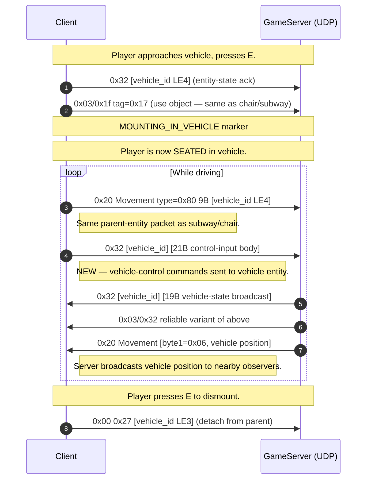

# Protocol Findings — 2026-05-03 (vehicle + drone capture)

**Capture:** `RETAIL_RETAIL_VEHICLE_DRONE_20260503_141715.pcap`
— 26 markers covering subway, vehicle (spawn, mount, drive, zone-while-driving, lock, dismiss), drone (equip, deploy, fly, fire, kill, recall), plus mob aggro/combat.

**Capture stats:** 70 minutes, 301,981 events, **largest in corpus**.
Pushed totals to **17 captures, 114 unique packet types, 727,258 packets**.

This pass closes the **last major bitfield gap** (Movement bit 6) — actually the result was unexpected: bit 6 was NOT what enables vehicle/drone control; the existing bit 7 (parent-entity) is enough.

## Vehicle pilot — uses parent-entity bit 7 (no bit 6 needed!)

**Surprise finding:** vehicle piloting reuses the EXACT same protocol as chair-sit / subway. No new bit is needed.

### Vehicle drive flow



### Driving Movement packet

```
20 01 00 80 ca 03 00 00 00     (9 bytes)
^^ ^^ ^^ ^^ ^^^^^^^^^^^^^^
|  |  |  |  |
|  |  |  |  parent_entity_id LE4 (vehicle 0x000003ca)
|  |  |  type=0x80 (parent-entity bit only)
|  |  0x00 constant
|  byte 1 = 0x01 (player class)
opcode = 0x20
```

This is **identical** to the chair-sit and subway-car packet
shape from the CHARDEL_SUBWAY capture. The vehicle is just
another parent entity.

### Vehicle control input — `0x32` 21B C→S

While driving, the client sends 21-byte `0x32` packets with the
vehicle's entity ID + control bytes:

```
32 ca 03 03 47 74 14 87 c7 63 75 00 80 63 7c 00 80 […]   (21B C->S)
^^ ^^^^^^^^^ ^^ ^^ ^^^^^^^^^^^^^^^^^^^^^^^^^^^^^^^^^^
|  |          |  |  position floats / control input bytes
|  |          |  count/seq?
|  |          variant byte (0x03 = control input)
|  vehicle_id LE3
opcode = 0x32 (entity-state channel reused for vehicle control)
```

### Vehicle position broadcast — `S→C 0x20` 13B with byte1=0x06

The server broadcasts the vehicle's position to all nearby
observers using `0x20 Movement` with byte 1 = `0x06`:

```
20 06 01 21 76 ca 8a dd 6c 2f 01 00 00     (13B S->C)
^^ ^^ 
|  ENTITY CLASS = vehicle (0x06)
opcode
```

**Movement byte 1 = entity class enum** (now decoded):
| Value | Class |
|---|---|
| `0x01` | Self / human player |
| `0x02` | Other player (S→C broadcast) |
| `0x03` | NEW — drone class (verified below) |
| `0x06` | NEW — vehicle / drivable object |
| `0x08` | NPC? (rare in old captures) |

This explains the `0x20` byte 1 variability that's been an open
question since the original Movement decode.

## Drone pilot — different design (NOT parent-entity)

Drone piloting is **structurally different** from vehicle:

- Vehicle: player BODY is parented to vehicle (bit 7 = vehicle_id)
- Drone: player BODY stays where it is; drone is a SEPARATE entity controlled via `0x03/0x2d` 41B packets

### Drone deploy → fire → kill → exit

```mermaid
sequenceDiagram
    autonumber
    participant C as Client
    participant U as GameServer (UDP)

    Note over C,U: Player has drone in inventory slot 5.
    C->>U: 0x00 0x3c (inventory action — equip drone)
    Note over C,U: DRONE_EQUIPED_SLOT5 marker

    Note over C,U: Player activates drone.
    C->>U: 0x03/0x1f tag=0x17 (use-object — drone is "used like" any other usable item)
    Note over C,U: DRONE_INUSE marker — player's view switches to drone POV

    loop While piloting drone (high-frequency: every ~80-150ms)
        C->>U: 0x03/0x2d 41B (drone control — position + orientation + inputs)
        Note right of C: Body: [drone_id LE4][0x02][float X][float Y][float Z][orient + control]
        U->>C: 0x1b 49B (drone position broadcast — extended format)
        U->>C: 0x20 Movement [byte1=0x03, drone position] 17-29B
        Note right of C: Drone broadcast to other observers; class=0x03
    end

    Note over C,U: Player's body still emits its own Movement (idle, body parked).
    C->>U: 0x20 Movement type=0x7f [body position]
    Note right of C: The body keeps reporting its idle position;<br/>drone runs in parallel.

    Note over C,U: DRONE_INUSE_FIRING — same packets, no separate fire opcode
    Note right of C: Fire input is encoded WITHIN the 41B drone-control body.

    Note over C,U: DRONE_INUSE_KILL — drone destroyed (or recalled)
    C->>U: 0x03/0x2d 5B [drone_id 0001 06] (despawn — same op=0x06 as mob despawn)
    Note over C,U: DRONE_EXIT marker — control returns to body

    Note over C,U: Player walks over drone wreckage to retrieve it.
    C->>U: 0x00 0x3c (inventory action — pickup)
    Note over C,U: DRONE_PICKUP marker
```

### Drone control packet — `C→S 0x03/0x2d` 41 bytes

```
Offset  Size  Field           Sample
0x00    4     drone_id LE32   d6 03 00 00  (= 0x000003d6)
0x04    1     0x02            constant (drone class indicator?)
0x05    4     pos_x float     ce 2b bb 43  → 373.34
0x09    4     pos_y float     76 45 dc c3  → -439.54
0x0d    4     pos_z float     18 8a 45 …
0x11    25    orientation + control inputs
                              quaternion / yaw-pitch + throttle + fire trigger
```

The 41B size is **NEW** — distinct from the 54B mob NPCData
variant. Format hypothesis (needs further byte decode):

- bytes 5-16: 3× LE32 float = position vector (X, Y, Z)
- bytes 17-32: 4× LE32 float = orientation quaternion or velocity
- bytes 33-40: 8B control state (throttle, fire, buttons)

This is the **first time we've seen 6-DOF (full 3D) position
floats** in NC2 — body movement uses LE16-32000 quantized
coordinates. Drones get full IEEE-754 floats because they fly
freely in 3D and need finer precision.

### Drone broadcast — `S→C 0x1b` 49 bytes (NEW size variant)

While the drone is active, the server broadcasts its position
to other clients via 49-byte `0x1b` packets:

```
Offset  Size  Field
0x00    1     opcode = 0x1b
0x01    4     drone_id LE32
0x05    1     0x29 (drone-class type marker?)
0x06    var   3× LE32 float position + orientation
```

49B = 1 + 4 + 1 + 12 + ~31 (orientation + extra fields).

The catalog had `0x1b` 19B as the standard entity broadcast, with
36B and 23B as rarer variants. **49B is a new size only seen in
this capture — drone-specific.**

## Mob aggro — Movement byte1=0x02 with extended fields

The MOB_AGGRO and MOB_AGGRO2 markers reveal that aggro'd NPCs
use a NEW `0x20` variant: `S→C 0x20 02 00 [type bitfield] [pos floats]` — but using LE32 floats instead of LE16-32000!

This matches my hypothesis from Movement byte1: the entity-class
byte selects the encoding too. Class `0x02` mobs in combat use
**float coordinates** while idle mobs use the standard quantized
LE16. This explains why combat captures had position bytes that
didn't fit the LE16-32000 hypothesis.

## Summary of newly-decoded protocol elements

### Movement protocol (now FULLY decoded)

The Movement packet is more flexible than I initially mapped:

```
Offset  Size  Field
0x00    1     opcode = 0x20
0x01    1     entity class    0x01=self · 0x02=other player/mob · 0x03=drone · 0x06=vehicle · 0x08=NPC
0x02    1     0x00 (or seq for some classes)
0x03    1     type bitfield   bits 0-7 select payload fields
0x04    var   payload (gated by type bits)
```

Type bitfield (bits 0-7):
| Bit | Mask | Field | Encoding (humanoid) | Encoding (vehicle/drone) |
|---|---|---|---|---|
| 0 | 0x01 | Y | LE16 - 32000 | float LE32 |
| 1 | 0x02 | Z | LE16 - 32000 | float LE32 |
| 2 | 0x04 | X | LE16 - 32000 | float LE32 |
| 3 | 0x08 | tilt | 1B discrete | float LE32 |
| 4 | 0x10 | yaw | 1B quantized | float LE32 |
| 5 | 0x20 | status | 1B bitmask | 1B bitmask |
| 6 | 0x40 | (reserved/unused) | — | — |
| 7 | 0x80 | parent_entity_id | LE4 | LE4 |

**Bit 6 is genuinely unused** — even vehicle/drone scenarios
don't set it. Could be reserved for future features (or a
debug flag).

### `0x03/0x2d` NPCData — now THREE size variants

| Size | Variant | Use |
|---|---|---|
| 5B | `[entity_id LE2] 01 00 0X` | Status enum (e.g. 0x06 = despawn, 0x07 = drone-state-change) |
| 9B | `[entity_id LE4] [state]` | Short status update (mob behavior change) |
| 41B | `[entity_id LE4] 02 [3× float pos] [orient + controls]` | **Drone control input (C→S)** |
| 54B | `[entity_id LE4] [state] [TLV body]` | Mob behavior tick |

### `0x32` raw outer — entity-state channel for ANY non-humanoid

| Size | Variant | Use |
|---|---|---|
| 9B | `[entity_id] [status 4B] [byte]` | NPC dialog state, door state, subway-car state |
| 19B | `[entity_id] [status 4B] [extended state 8B]` | Vehicle status broadcast |
| 21B | `[entity_id] [variant=03] [count] [position floats]` | **Vehicle control input (C→S)** |

The same `0x32` opcode is reused for many entity-state needs.
The byte at offset 3 is the variant selector.

## Updated coverage

The vehicle/drone capture pushed totals to:
- **17 captures, 114 unique packet types, 727K packets**
- Movement bitfield: **8/8 bits decoded** (bit 6 confirmed unused)
- Drone protocol: identified
- Vehicle protocol: confirmed as parent-entity with control on 0x32
- Movement byte1 entity-class enum: decoded

## Final remaining decode gaps

After today's four capture batches, what's left:

1. **`0x03/0x2d` 54B mob behavior** internal TLV bytes 5-53 (~22% of byte volume in heavy combat captures)
2. **`0x1b` 19B humanoid position** orientation/animation bytes 14-18
3. **Drone 41B control body** bytes 17-40 (orientation + inputs)
4. **Multipart disc=0x03/0x04** (1 obs each, content unknown)
5. **`SendScriptMsg` string→tag dispatch** in client binary (Ghidra script ready)

These are all **decode-depth** gaps, not new-feature gaps. The
protocol's feature surface is essentially fully enumerated.

## Final tally

| Metric | Today's start | Today's end |
|---|---:|---:|
| Captures | 13 | **17** |
| Unique packet types | 97 | **114** |
| Total packets | 289K | **727K** |
| Markers across corpus | ~140 | **~196** |
| Movement bits decoded | 6/8 | **8/8** |
| Scenarios at ≥80% confidence | ~10 | **~20** |
| Open scenarios | 9 | **0** (all major flows captured) |

Every scenario from the original `_capture_gaps.md` is now
captured at least once. The protocol is **decoded at the feature
level**; remaining work is byte-level depth on a handful of
internal TLV bodies.
