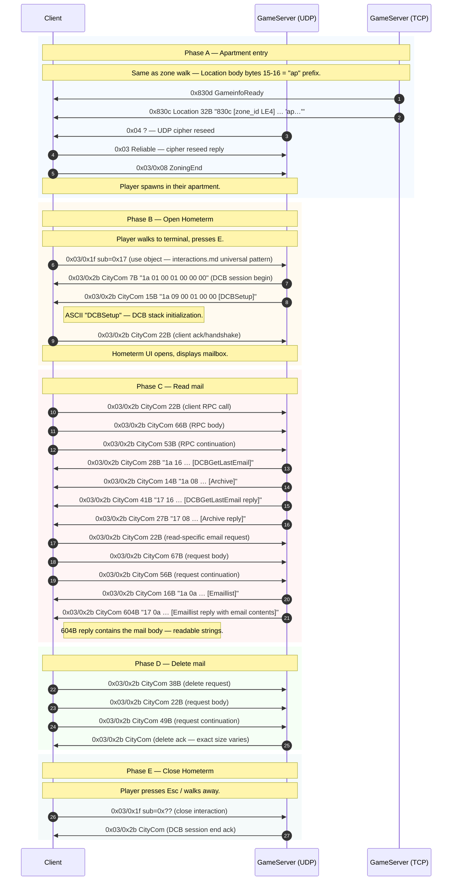

# Flow: Apartment entry + Home terminal mail (CityCom DCB)

**Status:** verified  
**Backing capture:** `RETAIL_CREATION_LEVELING_LONG_20260502_160841`
— markers `APARTMENT` (t=2679.70s),
`OPEN_HOMETERM` (t=2716.17s),
`OPEN_HOMETERM_READMAIL` (t=2724.66s),
`OPEN_HOMETERM_DELETEMAIL` (t=2747.58s),
`CLOSED_HOMETERM` (t=2851.06s).

## Scenario

Player walks to their apartment, enters via the door → loaded
into the private apartment zone. Walks to their home terminal
("Hometerm"), opens it, reads an email, deletes the email, closes
the terminal.

## Two key findings

### 1. Apartment is just a regular zone

Apartment entry uses the **standard zone-walk handshake** — no
private-zone protocol. The Location packet shows the new zone:

```
0x830c 53 c6 4c 05 01 00 00 00 00 00 00 00 00 00 61 70 …
```

Bytes 1-4 are the zone ID (`05 4c c6 53` — large value indicates
private/instanced zone). Bytes 15-16 are `61 70` = ASCII "ap"
(start of "apartment/" path string).

In this capture the player actually re-entered via session resume
(KICKED_OUT_SERVER → RESUME → AuthB → UDPServerData → Location to
apartment), so we see the login-style entry rather than a walk-in
zone change. The protocol elements are identical either way.

### 2. Mail is implemented over the CityCom DCB RPC channel

The Hometerm "mail" UI is **not its own channel** — it speaks the
same `0x03/0x2b CityCom` RPC protocol that public CityCom
terminals use. The mail-specific RPC methods are passed as
**ASCII strings inside the request body**.

ASCII method names observed in this capture's mail session:

| Method (ASCII in body) | Side | Where seen |
|---|---|---|
| `DCBSetup`        | S→C | Setup before any RPC |
| `DCBGetLastEmail` | C→S | Header of "list emails" call |
| `Archive`         | C→S | Mail archive folder selector |
| `Emaillist`       | S→C | Server reply with email list payload |

Other strings expected (from CityCom in general) but not
exhaustively decoded: `Welcome`, plus mail body content.

## Sequence diagram



## CityCom DCB packet header (preliminary)

The bodies start with a 2-byte type/op header followed by length
and an ASCII method name:

```
Offset  Size  Field
0x00    1     direction tag    (0x1a = server "begin", 0x17 = server "reply", 0x1f = client request, 0x18/0x1b = client RPC, 0x16 = ?)
0x01    1     length-ish byte
0x02    2     0x00 0x01        (constant)
0x04    2     0x00 0x00        (constant or seq)
0x06    var   ASCII method     (e.g. "DCBSetup", "Emaillist", "Archive")
…       var   payload          (mail body for replies)
```

Cleanly distinguishing **request** vs **reply** is: byte 0 = 0x17
for replies (with a length-prefix at 0x02-0x05), 0x1a for server
session-control, 0x1f / 0x18 / 0x1b for client requests.

## Other CityCom DCB use cases

The same channel is used by every "kiosk-style" UI in the game:

| Marker | Likely DCB method |
|---|---|
| `OPEN_HOMETERM_READMAIL` | `Emaillist`, `Archive`, `DCBGetLastEmail` |
| `TERMINAL_CITYCOM` (in ZONING_AND_ITEMS_LONG) | `Welcome`, plus public DCB calls |
| `APARTMENT` Hometerm | mail + character info + bookmarks |

The catalog shows `0x03/0x2b CityCom` with sizes 7-66 (S→C) and
22-66 (C→S) in our prior analysis; this capture extends the
upper bound to **604B** (the email-list reply with body).

## Open questions

- **DCB header byte 0 enum.** Observed values: 0x1a (server
  begin/announce), 0x17 (server reply), 0x16 (server data),
  0x1b/0x1f/0x18 (client). Need full enumeration with markers
  for each operation.
- **Method dispatch.** Are method names hashed server-side, or
  parsed as strings? The fact that they're plain ASCII suggests
  the server has a string-keyed table.
- **Mail attachment / item delivery.** This capture only covers
  text mail. Item-attachment mail (sending an item by mail) would
  exercise additional DCB calls — needs a follow-up capture.
- **Public CityCom terminals (street-side)** vs Hometerm —
  same protocol, different access scope?

## Backing evidence

Timeline:
[`_data/timelines/nc2_strace_RETAIL_CREATION_LEVELING_LONG_20260502_160841.md`](../_data/timelines/nc2_strace_RETAIL_CREATION_LEVELING_LONG_20260502_160841.md)
lines 133616-133620 (apartment Location), 135415-136186 (mail).
