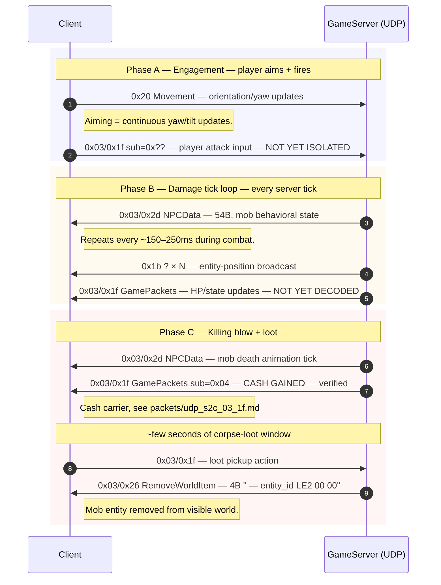

# Flow: Combat — player kills an NPC mob

**Status:** partial  
**Backing captures:**
- `RETAIL_AUGUSTO_20260426_201952` — KILL_MOB (87.07s), KILL_MOB2 (178.96s)
- `RETAIL_HANNIBAL_20260426_201501` — KILL_MOB (118.55s), KILL_MOB2 (162.58s)
- `RETAIL_NORMAN_20260426_200458` — KILL_MOB (137.49s), KILL_MOB2 (147.64s), KILL_MOB3 (321.68s)
- `RETAIL_ODA_20260426_202428` — KILL_MOB through KILL_MOB6 (multiple)

**Important caveat:** kill markers are user-placed and approximate
(±2–10 s). The exact wire-level "mob died" event has not been
isolated to a single packet. The flow below is what we can
*verify*; what we *suspect* is flagged in Open Questions.

**Update from `RETAIL_CREATION_LEVELING_LONG_20260502_160841`:**
the new capture has clean `KILLED_CRAWLER` (t=1082.68) and `LOOT`
(t=1093.09) markers. New findings:

- **`0x03/0x2d` byte 4** does flip on death: live mobs show
  `71 20 …` (in-combat), the just-killed mob then briefly shows
  `75 00 00 …` (transition / dying), then `75 2f 01 …` (corpse).
- **Loot pickup** is a `0x1f` raw outer 4-byte request →
  8-byte reply pattern:

  | Dir | Body | Meaning |
  |---|---|---|
  | C→S | `1f bd 03 55` (4B) | "open corpse / pick loot" — bytes 1-2 = entity ID `0x03bd`, byte 3 = `0x55` op |
  | S→C | `1f bd 03 56 00 00 00 00` (8B) | "loot listing reply" — byte 3 incremented to `0x56` |
  | S→C | `0x3c ?` (12B `3c 01 00 00 [qty LE4] [item LE4]`) | quantity + item ID |
  | C→S | `0x00 ?` (12B `00 3c 01 00 00 [item_id LE4] [chksum]`) | inventory put-in (op=0x00 = loot-into-inventory) |

## Scenario

Player faces an NPC mob, fires a weapon, takes the mob to zero
HP. Mob plays death animation, drops loot, server removes the
mob's entity ID from the visible world.

## Sequence diagram



```mermaid
sequenceDiagram
    autonumber
    participant C as Client
    participant U as GameServer (UDP)

    rect rgb(245,245,255)
    Note over C,U: Phase A — Engagement (player aims + fires)
    C->>U: 0x20 Movement (orientation/yaw updates)
    Note right of C: Aiming = continuous yaw/tilt updates.
    C->>U: 0x03/0x1f sub=0x?? (player attack input — NOT YET ISOLATED)
    end

    rect rgb(255,250,240)
    Note over C,U: Phase B — Damage tick loop (every server tick)
    U->>C: 0x03/0x2d NPCData (54B; mob behavioral state)
    Note right of C: Repeats every ~150–250ms during combat.
    U->>C: 0x1b ? × N (entity-position broadcast)
    U->>C: 0x03/0x1f GamePackets (HP/state updates — NOT YET DECODED)
    end

    rect rgb(255,245,245)
    Note over C,U: Phase C — Killing blow + loot
    U->>C: 0x03/0x2d NPCData (mob death animation tick)
    U->>C: 0x03/0x1f GamePackets sub=0x04 (CASH GAINED — verified)
    Note right of C: Cash carrier, see packets/udp_s2c_03_1f.md
    Note over C,U: ~few seconds of corpse-loot window
    C->>U: 0x03/0x1f (loot pickup action)
    U->>C: 0x03/0x26 RemoveWorldItem (4B "[entity_id LE2] 00 00")
    Note right of C: Mob entity removed from visible world.
    end
```

## What's verified (from catalog)

| Packet | Role | Confidence |
|---|---|---|
| `UDP S->C 0x1b ?` (19B) | Mob position broadcast (every entity, every tick) | high — 27,298 obs across all captures |
| `UDP S->C 0x03/0x2d NPCData` (54B) | Mob behavior tick (idle/attack/death animation) | high — 5,832 obs, top markers KILL_MOB2/KILL_MOB |
| `UDP S->C 0x03/0x1f sub=0x04` | Cash gained on kill | high — verified against retail HUD on 3 mob kills (memory: cash_and_falldamage_subops) |
| `UDP S->C 0x03/0x26 RemoveWorldItem` (4B) | Removes an entity ID from world | high — 104 obs, fires after KILL_MOB markers |
| `UDP S->C 0x1f ?` (varying) | "burst" sub-tag stream during combat | medium — fires at every KILL_MOB marker |

## RemoveWorldItem analysis

In `RETAIL_HANNIBAL` we see:
- KILL_MOB at 118.55s
- KILL_MOB2 at 162.58s
- `0x03/0x26 RemoveWorldItem` at 172.26s × 2 (entity 0x03e1)
- `0x03/0x26 RemoveWorldItem` at 181.27s (entity 0x00ff)

Two `RemoveWorldItem` ~10s after each KILL_MOB marker. The doubled
packets at 172.26 are reliable retransmits of the same payload
(`e1030000`) — both have `Δ=0ms` which means same UDP datagram.

The 4-byte body is the entity ID being removed (LE32):
- `e1 03 00 00` = entity 0x03e1 = 993
- `ff 00 00 00` = entity 0x00ff = 255
- `42 01 00 00` = entity 0x0142 = 322 (in AUGUSTO)

This is the "world list invalidation" — telling the client to drop
the entity from its visible-world set. It happens AFTER the kill,
not at the moment of death (the mob plays its death animation in
the interim, driven by `0x03/0x2d`).

## What's NOT yet isolated

### 1. The "kill" event itself

Markers are placed by the user clicking a key when they observe
the kill on-screen. Wire-side, the kill is a state transition in
`0x03/0x2d` — but we don't know which byte. Possible candidates:
- `0x03/0x2d` body byte 4 might be a state flag
  (`75` = idle, `71` = combat, `00` = dead?). Sample at AUGUSTO
  t=87.85 shows `…ec03000071…` while normally `…ec03000075…`.
- Or it could be `0x03/0x1f` carrying an HP-zero event.

Differential analysis between two captures of the same mob (one
killed, one fled) would isolate it. We don't have such a paired
capture.

### 2. ~~The player's attack input~~ — IDENTIFIED 2026-05-03

The weapon-fire packet is **`UDP C→S 0x03/0x1f` tag `0x01` sub `0x23`**.

Body shape (19 bytes fixed):

```
01 00 01 23 01 [target_entity_id LE4] [aim/hit data ~10B]
```

Verified at LOOT marker (t=1093.09) in
`RETAIL_CREATION_LEVELING_LONG_20260502_160841`: just-killed
crawler had entity_id `0x03bd`. The C→S `01 00 01 23 01 bd 03 00 00 …`
packets at t=1065-1071 (during COMBAT marker) match exactly.

The `sub=0x4c` 7B packet (`01 00 4c ff ff 03 00`) at 10-second
intervals is unrelated — it's a combat-readiness heartbeat that
fires whenever the player has a weapon out. See
[`OPCODE_STRUCTURE.md`](../OPCODE_STRUCTURE.md) tag-distribution
table.

The target ID in the body (bytes 5-8) is the entity the player
is shooting at. For PvE: mob ID. For PvP: player ID.

**Cadence:** sparse (~0.5 Hz when active) — consistent with rifle
trigger pulls rather than continuous aim-tracking.

### 3. HP delta packets

Self-HP delta from foreign damage — not yet decoded. The `0x1f`
sub-tag map memory mentions `0x30` (HP/PSI/STA pool status burst)
and `0x50` (HP delta) but those refer to FOREIGN entity HP, not
the player's own HUD (per `cash_and_falldamage_subops` memory).

## Open questions

- **Player attack input packet.** Need a capture where the user
  marks `BEFORE_FIRE` and `AFTER_FIRE` immediately around a single
  trigger pull, with no other inputs in the window.
- **Mob death byte.** Is byte 4 of `0x03/0x2d` a state/animation
  flag? Need differential analysis of two captures: same mob
  killed vs same mob fled.
- **Self-HP loss when hit.** No packet observed in the corpus
  modifies the player's own HP HUD. The `cash_and_falldamage_subops`
  memory says self-pools are CharInfo-derived only — but combat
  must update them. Capture: melee combat where the player takes
  damage.
- **`0x03/0x1f sub=0x4c` 10-second heartbeat.** What state does
  it represent? Periodic combat-readiness ack?
- **Corpse loot pickup C→S.** What does the client send to the
  server when looting?

## Backing evidence

Timelines:
- AUGUSTO: search for `KILL_MOB` markers in
  [`_data/timelines/nc2_strace_RETAIL_AUGUSTO_20260426_201952.md`](../_data/timelines/nc2_strace_RETAIL_AUGUSTO_20260426_201952.md)
- HANNIBAL: lines 4120, 6517, 7120-7121
- NORMAN: lines 175, 176, 180

Per-packet docs:
[`udp_s2c_03_2d.md`](../packets/udp_s2c_03_2d.md),
[`udp_s2c_03_26.md`](../packets/udp_s2c_03_26.md),
[`udp_s2c_03_1f.md`](../packets/udp_s2c_03_1f.md).
