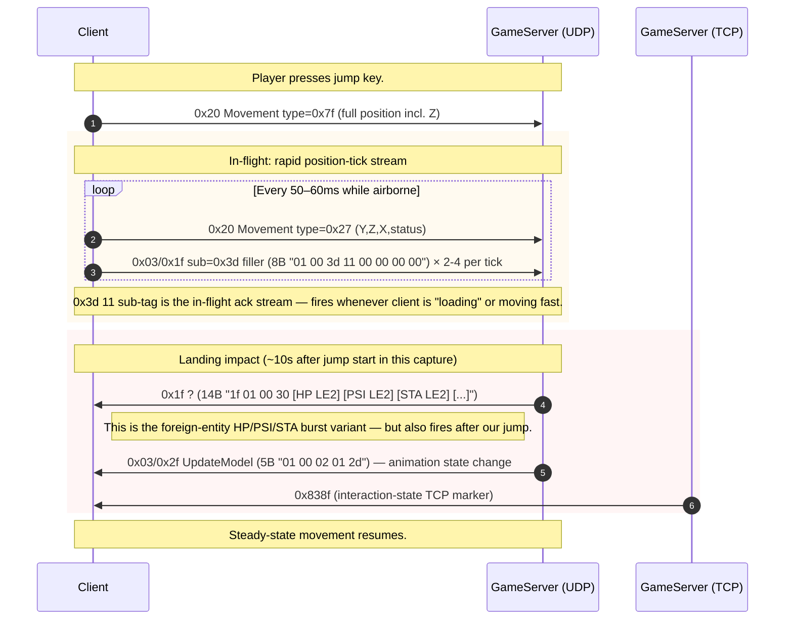

# Flow: Fall damage

**Status:** partial  
**Backing capture:**
`RETAIL_CASH_VENDOR_PCAP_FRESH_20260426_143918` — markers
`BEFORE_JUMP` (82.58s), `AFTER_JUMP` (93.95s).

**Caveat:** the capture window is wide (~11s between markers
covering the entire jump). The exact wire-level "took fall
damage" event is not isolated — it could be at impact (~93s) or
shortly after (94.22s).

## Scenario

Player jumps from a height; on landing, server applies fall
damage proportional to vertical velocity, decreasing the HP
pool and playing the fall-damage sound.

## Sequence diagram

## What's verified

| Packet | Role | Confidence |
|---|---|---|
| `UDP C->S 0x20 Movement type=0x27` | Position/Z update during fall | high |
| `UDP C->S 0x03/0x1f sub=0x3d` (8B `01 00 3d 11 00 00 00 00`) | "in-flight" filler/ack stream | high — fires in bursts during fall AND during zone load |
| `UDP S->C 0x1f ?` (14B `1f 01 00 30 …`) | Pool status update | medium — observed at landing time but the packet is not fall-specific (also fires throughout combat) |
| `UDP S->C 0x03/0x2f UpdateModel` (5B `01 00 02 01 2d`) | Animation state change | medium — fires shortly after AFTER_JUMP |

## What's NOT isolated

### 1. The exact "fall damage" packet

The marker `AFTER_JUMP` is at 93.95s. Within ±2s the only S→C
packets are:
- `0x03/0x1f` (5B `0100252320`) — periodic heartbeat
- `0x1b ?` × N — entity stream
- `0x1f ?` (14B at 94.22) — possibly the HP delta but format
  matches foreign-entity bursts elsewhere
- `0x03/0x2f UpdateModel` (5B at 96.55) — too late to be the
  damage event itself, more likely "fall recovery animation"

### 2. Self-HP delta

The `cash_and_falldamage_subops` memory documented:
- C→S `0x03/0x1f` sub `0x3d` (~16 in 280ms during fall) — **CONFIRMED** in this capture
- S→C `0x03/0x2d` paired sub-types `0x0f` (velocity float) +
  `0x10` (world-Z float) — **NOT OBSERVED in this capture**

The `0x03/0x2d` sub `0x0f` / sub `0x10` pair would be inside the
54-byte body of an `0x03/0x2d` NPCData packet, encoded as TLV.
Need to decode the 54B body to find them.

## Open questions

- **`0x1f ?` 14B body format.** Is `byte 4 = 0x80` here the HP
  in some quantization? Across captures we see different values
  (`80 00`, `70 00`, `75 01`, …) but no clear correlation with
  visible HP changes.
- **Fall damage HP delta packet.** Need a capture with
  `BEFORE_JUMP_HP=X` and `AFTER_JUMP_HP=Y` markers AND the user
  reading off the HUD numbers, so we know what HP delta to
  search for.
- **`0x03/0x2f UpdateModel` 5B variant** — is `01 00 02 01 2d`
  a generic animation-state change (could fire for any
  state change like sit/stand) or specific to fall recovery?

## Backing evidence

Timeline window:
[`_data/timelines/nc2_strace_RETAIL_CASH_VENDOR_PCAP_FRESH_20260426_143918.md`](../_data/timelines/nc2_strace_RETAIL_CASH_VENDOR_PCAP_FRESH_20260426_143918.md)
lines 2378-2718.

The 0x3d in-flight burst is verified — see lines 2420-2470
(50× `01 00 3d 11 00 00 00 00` in ~600ms). The cadence (every
~50ms with 3-4 packets per "tick") matches the prior memory's
"~16/280ms" claim within a factor of 2.
