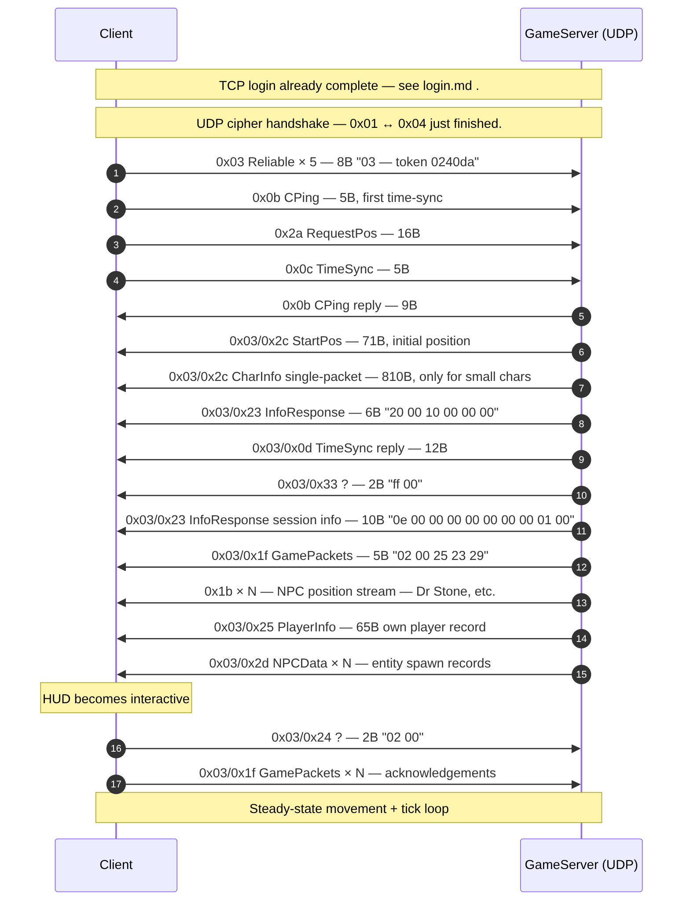

# Flow: Fresh-character world entry (Genesis Dr Stone tutorial)

**Status:** verified  
**Backing captures:**
- `RETAIL_DRSTONE_20260501_172522` (59s, fresh login + initial movement)
- `RETAIL_DRSTONE_20260501_175315` (284s, fresh login + tutorial dialogue)
- `RETAIL_DRSTONE3_20260501_181349` (80s, with markers)
- `RETAIL_DRSTONE4_20260501_193336` (77s, with marker)

## Scenario

A fresh character (CharInfo body ≤ ~900B) spawns in the Genesis
Dr Stone tutorial zone. The CharInfo fits in a single UDP packet,
so this flow is the canonical "small-character world entry" — the
test bed used to verify the `0x03/0x2c` single-packet path.

## How it differs from veteran world entry

| Aspect | Genesis (DRSTONE) | Veteran (NORMAN/AUGUSTO/…) |
|---|---|---|
| CharInfo channel | `0x03/0x2c` single packet (~810B body) | `0x03/0x07/0x01` multipart |
| `0x8737/0x873a` Gamedata exchange | Skipped | Present in phase 2 |
| `0x830d GameinfoReady` | Not sent | Sent before Location |
| `0x873c GetUDPConnection` | Not sent | Sent by client |

## Sequence diagram (UDP world-entry burst — first ~250 ms)



```mermaid
sequenceDiagram
    autonumber
    participant C as Client
    participant U as GameServer (UDP)

    Note over C,U: TCP login already complete (see login.md).
    Note over C,U: UDP cipher handshake (0x01 ↔ 0x04) just finished.

    C->>U: 0x03 Reliable × 5 (8B "03 [token] 0240da")
    C->>U: 0x0b CPing (5B; first time-sync)
    C->>U: 0x2a RequestPos (16B)
    C->>U: 0x0c TimeSync (5B)

    U->>C: 0x0b CPing reply (9B)
    U->>C: 0x03/0x2c StartPos (71B; initial position)
    U->>C: 0x03/0x2c CharInfo single-packet (810B; only for small chars)
    U->>C: 0x03/0x23 InfoResponse (6B "20 00 10 00 00 00")
    U->>C: 0x03/0x0d TimeSync reply (12B)
    U->>C: 0x03/0x33 ? (2B "ff 00")
    U->>C: 0x03/0x23 InfoResponse session info (10B "0e 00 00 00 00 00 00 00 01 00")
    U->>C: 0x03/0x1f GamePackets (5B "02 00 25 23 29")
    U->>C: 0x1b × N (NPC position stream — Dr Stone, etc.)
    U->>C: 0x03/0x25 PlayerInfo (65B own player record)
    U->>C: 0x03/0x2d NPCData × N (entity spawn records)

    Note over C: HUD becomes interactive
    C->>U: 0x03/0x24 ? (2B "02 00")
    C->>U: 0x03/0x1f GamePackets × N (acknowledgements)
    Note over C,U: Steady-state movement + tick loop
```

## Phase-by-phase walkthrough (DRSTONE 172522, t=26.0–28.0s)

### Phase A — Client→Server UDP cipher handshake

| t (s) | Dir | Packet | Bytes |
|---:|---|---|---|
| 22.15 | C→S | `0x01 ?` × 3 | `01 4a c7 30 48 2f 48 46 ac 00` (10B) |
| 22.41 | S→C | `0x04 ?` × 4 | `04 02 00 01 77 40 da` (7B) |

The `0x01` and `0x04` packets carry a 9-byte token-like body that
appears to seed the cipher keystream and resolve the per-zone
session token. Verbose retransmissions (4 copies of the server
reply) match standard NC2 reliable delivery.

### Phase B — First-tick alive packets (t≈26.0s)

| t (s) | Dir | Packet | Bytes | Notes |
|---:|---|---|---|---|
| 26.01 | C→S | `0x03 Reliable` × 5 | `03 [token LE2] 02 40 da` (8B) | First reliable acks |
| 26.02 | C→S | `0x0b CPing` | `0b dc 9d 51 01` (5B) | Time sync ping; bytes 1-3 = client ms tick |
| 26.03 | C→S | `0x2a RequestPos` | `2a [token] 00 40 f6 6c b0 5f 34 6f c5 df 09 00` (16B) | Asks server for player's position record |
| 26.03 | C→S | `0x0c TimeSync` | `0c e5 9d 51 01` (5B) | Companion to CPing |

### Phase C — Server world-entry burst (t≈26.30s, all in one ms)

| t (s) | Dir | Packet | Sz | Bytes/Notes |
|---:|---|---|---:|---|
| 26.30 | S→C | `0x0b CPing` reply | 9 | `0b a0 52 17 00 dc 9d 51 01` |
| 26.30 | S→C | `0x03/0x2c` StartPos | 71 | `01 02 01 [coords/orientation] …` — initial position |
| 26.30 | S→C | `0x03/0x2c` CharInfo | 810 | `02 02 01 0a 00 fa …` — single-packet CharInfo body. Body begins `02 02 01` (compare multipart's `22 02 01`); the `02` instead of `22` flags single-packet mode. |
| 26.30 | S→C | `0x03/0x23` InfoResponse | 6 | `20 00 84 00 00 00` — zone/entity info marker |
| 26.30 | S→C | `0x03/0x0d` TimeSync reply | 12 | echoes the client's time tick |
| 26.38 | S→C | `0x03/0x33` ? | 2 | `ff 00` — appears once per world entry; meaning unknown |
| 26.38 | S→C | `0x03/0x23` InfoResponse session | 10 | `0e 00 00 00 00 00 00 00 01 00` — session-info variant |
| 26.38 | S→C | `0x03/0x1f` GamePackets | 5 | `02 00 25 23 29` — initial GamePackets seed |
| 26.38 | S→C | `0x03/0x25` PlayerInfo | 65 | own-player record |
| 26.38 | S→C | `0x1b ?` × ~30 | 19 each | NPC entity stream (positions of every NPC in the zone) |

### Phase D — Client acks + steady state (t≈26.46s onward)

The client immediately starts streaming back:
- `0x03/0x24 ? (2B "02 00")` — appears to be a "world stream ready" marker
- `0x03/0x1f GamePackets` carrying various sub-tags (`0x3e`, `0x3d`, `0x4c`)
- `0x20 Movement` once the player presses a movement key

## Open questions

- **`0x01` / `0x04` UDP handshake bodies.** Format observed but
  semantics not decoded.
- **`0x03/0x33 (ff 00)`** — fires once per world entry. Why?
  Maybe a "world stream complete" terminator?
- **`0x03/0x2c` body prelude byte `0x02` vs multipart's `0x22`**
  — what does this byte select?
- **The 810B threshold.** Empirically consistent across captures
  but the exact tip-over point is server-side; the client's
  reassembler accepts both paths.

## Related captures and packet docs

- Per-packet: [`udp_s2c_03_2c.md`](../packets/udp_s2c_03_2c.md)
  (StartPos / single-packet CharInfo)
- Per-packet: [`udp_s2c_03_25.md`](../packets/udp_s2c_03_25.md)
  (PlayerInfo)
- Per-packet: [`udp_s2c_03_23.md`](../packets/udp_s2c_03_23.md)
  (InfoResponse — zone-info and session-info variants)
- Compare against [`login.md`](login.md) Phase 4 for the
  cross-flow context.
