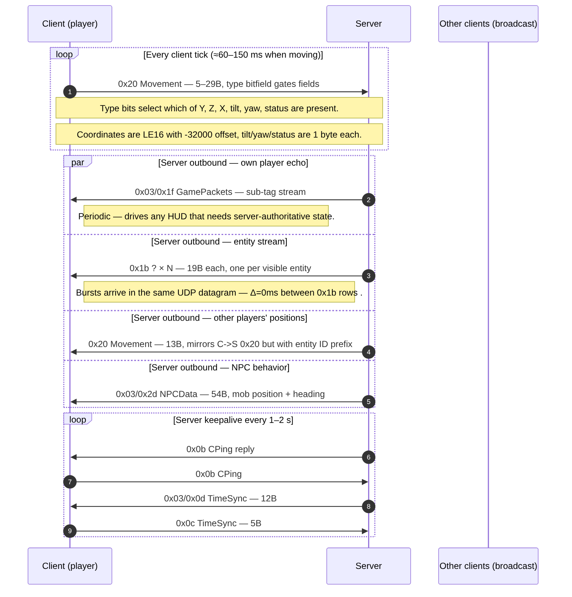

# Flow: In-world movement (steady-state position streaming)

**Status:** verified  
**Backing captures:** every retail capture; movement is the dominant
traffic class. Reference walkthroughs:
- `RETAIL_DRSTONE4_20260501_193336` — fresh char walking around tutorial
- `RETAIL_ZONING_AND_ITEMS_LONG_20260502_010613` — long session with
  multiple movement bursts (`WALK_TO_PEPPERPARK_*` markers)

## Scenario

The player is in-world and moving. The client streams position
updates upward; the server fans them out to nearby players and
broadcasts the positions of every other entity (NPCs, mobs, other
players) downward.

## Sequence diagram



```mermaid
sequenceDiagram
    autonumber
    participant C as Client (player)
    participant S as Server
    participant B as Other clients (broadcast)

    loop Every client tick (≈60–150 ms when moving)
        C->>S: 0x20 Movement (5–29B; type bitfield gates fields)
        Note over C,S: Type bits select which of {Y, Z, X, tilt, yaw, status} are present.
        Note over C,S: Coordinates are LE16 with -32000 offset; tilt/yaw/status are 1 byte each.
    end

    par Server outbound — own player echo
        S->>C: 0x03/0x1f GamePackets (sub-tag stream)
        Note right of C: Periodic — drives any HUD that needs server-authoritative state.
    and Server outbound — entity stream
        S->>C: 0x1b ? × N (19B each; one per visible entity)
        Note right of C: Bursts arrive in the same UDP datagram (Δ=0ms between 0x1b rows).
    and Server outbound — other players' positions
        S->>C: 0x20 Movement (13B; mirrors C->S 0x20 but with entity ID prefix)
    and Server outbound — NPC behavior
        S->>C: 0x03/0x2d NPCData (54B; mob position + heading)
    end

    loop Server keepalive every 1–2 s
        S->>C: 0x0b CPing reply
        C->>S: 0x0b CPing
        S->>C: 0x03/0x0d TimeSync (12B)
        C->>S: 0x0c TimeSync (5B)
    end
```

## C→S `0x20` Movement format (verified from
[`packets/udp_c2s_20.md`](../packets/udp_c2s_20.md))

```
Offset  Size  Field
0x00    1     opcode = 0x20
0x01    1     ?              (0x01 in steady state, 0x04 during world entry)
0x02    1     0x00           (always)
0x03    1     type bitfield  ← gates the optional fields below
0x04    var   gated payload
```

Gated payload (in order, each present only if its bit is set in
`type`):

| Bit | Mask | Size | Field | Encoding |
|---|---|---:|---|---|
| 0 | 0x01 | 2 | Y | LE16 - 32000 |
| 1 | 0x02 | 2 | Z | LE16 - 32000 |
| 2 | 0x04 | 2 | X | LE16 - 32000 |
| 3 | 0x08 | 1 | tilt | discrete: `0xd6` up · `0x80` mid · `0x2a` down |
| 4 | 0x10 | 1 | yaw | quantized angle |
| 5 | 0x20 | 1 | status | bitmask: kneel/step/walk/forward/backward |
| 6 | 0x40 | ? | unknown | observed in `type=0x7f` packets |

Observed `type` values from DRSTONE4 t=22-32s:

| `type` | Sz | Meaning |
|---|---:|---|
| `0x20` | 5 | Status only — kneel/stand toggle without moving |
| `0x28` | 17 | tilt + status — looking up/down |
| `0x30` | 17 | yaw + status — turning in place |
| `0x7f` | 29 | Full update: Y, Z, X, tilt, yaw, status, +bit-6 unknown |

When the player walks forward, `0x7f` packets stream at ~7-15 Hz
(60-150ms inter-arrival). When standing still and turning, `0x30`
packets fire at similar cadence. When fully idle, `0x20`
status-only packets fire less frequently (~1 packet per second
during BASELINE_HUD markers).

## S→C `0x20` Movement format (foreign players)

```
Offset  Size  Field
0x00    1     opcode = 0x20
0x01    1     0x08           (always — distinguishes from C→S 0x01)
0x02    1     0x01           (always — 'authoritative' flag?)
0x03    1     ?              (varies)
0x04    1     ?              (always 0x7b in observed)
0x05    1     ?              (varies)
0x06    1     0x7f           (always)
0x07    1     ?              (always 0xa3-0xa9)
…
```

Sample at t=870.86 from ZONING_AND_ITEMS_LONG: `20 08 01 6b 7b
a0 7f a3 7c 1a 18 00 00` (13B). Format not yet fully decoded —
needs differential analysis between two captures of the same
character to isolate variable bytes.

## S→C `0x1b ?` — Entity position stream

19 bytes per packet. Multiple packets in one UDP datagram (the
server batches all visible entity positions into a single
0x13-wrapped frame, so the timeline shows them with Δ=0ms
between rows).

Sample: `1b 01 01 00 00 1f 2f 98 f8 83 79 7a 40 f1 48 00 00 00 00`
- Byte 0: `0x1b` opcode
- Bytes 1-2: entity ID LE16 (0x0101 = 257 in this sample)
- Bytes 3-4: `00 00` (always)
- Byte 5: `0x1f` (type/status?)
- Bytes 6-...: coordinates, heading, animation state

The catalog shows 27,298 occurrences across 12 captures — this is
the highest-volume packet in the entire protocol. It's the
NPC/mob position broadcast that drives the visible world.

## S→C `0x03/0x2d` NPCData — Mob behavior tick

54 bytes typically. Drives mob animation state and behavioral
ticks (idle, attacking, dying). Heavy correlation with `KILL_MOB`
markers in AUGUSTO/HANNIBAL/NORMAN/ODA captures.

## Timing observations

From DRSTONE4 t=22-90s (one continuous walk):

- C→S `0x20` Movement: ~7-15 packets/sec while moving, ~1/sec idle
- S→C `0x1b`: bursts of 30+ packets in single datagrams every
  ~200-300ms (server tick rate)
- C→S `0x0b CPing`: every ~1.0s
- C→S `0x03/0x1f GamePackets`: every ~2-3s (state ack stream)

## Open questions

- **C→S `0x20` byte 1.** Always `0x01` in steady state but
  `0x04` in some early-world-entry packets. What does it select?
- **C→S `0x20` bit 6 (`type & 0x40`).** Always set in `0x7f`
  packets but the payload format is unknown. Suspect velocity or
  vehicle/drone state.
- **S→C `0x20` 13-byte format.** Different layout from the C→S
  side. Needs differential analysis.
- **S→C `0x1b` byte 5 = `0x1f`.** Constant across all
  observations — looks like an "entity update" type tag. What
  are the other type values (if any)?

## Related

- Per-packet docs: [`udp_c2s_20.md`](../packets/udp_c2s_20.md),
  [`udp_s2c_20.md`](../packets/udp_s2c_20.md),
  [`udp_s2c_1b.md`](../packets/udp_s2c_1b.md),
  [`udp_s2c_03_2d.md`](../packets/udp_s2c_03_2d.md).
- Movement crossing a zone edge: [`zone_walk_same_district.md`](zone_walk_same_district.md).
