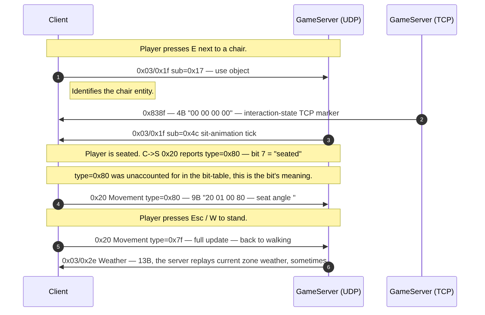
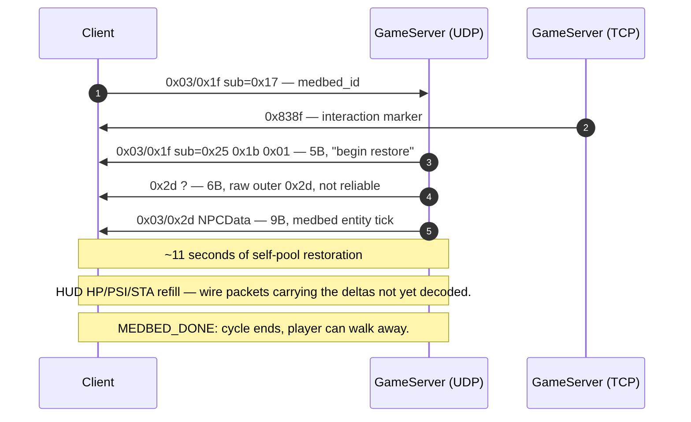
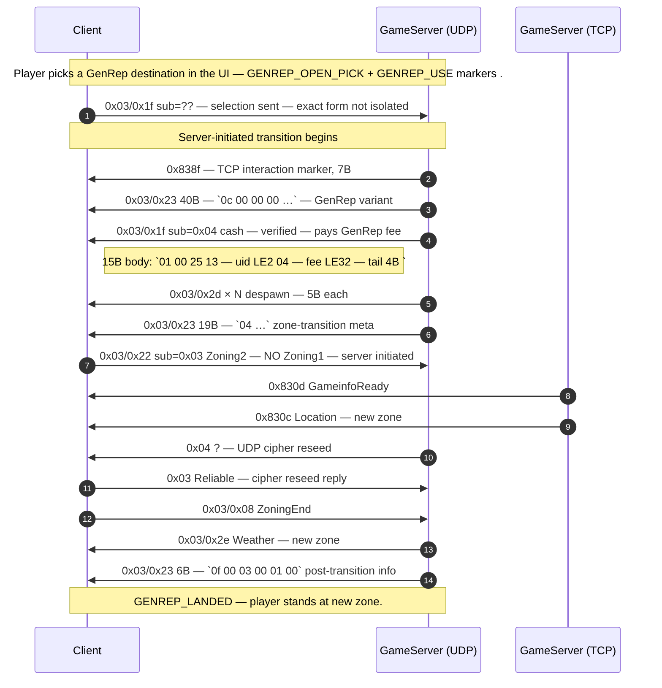
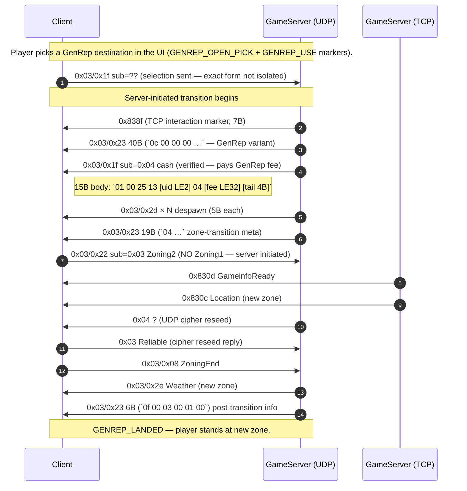
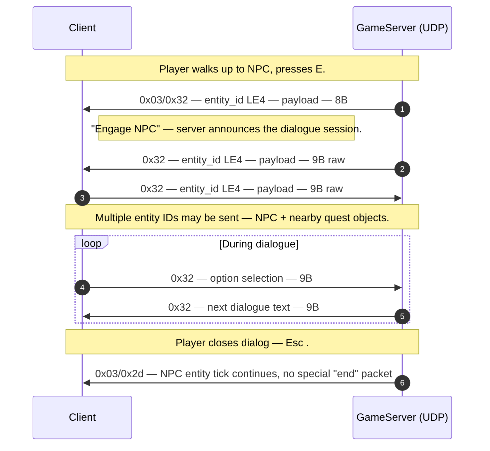
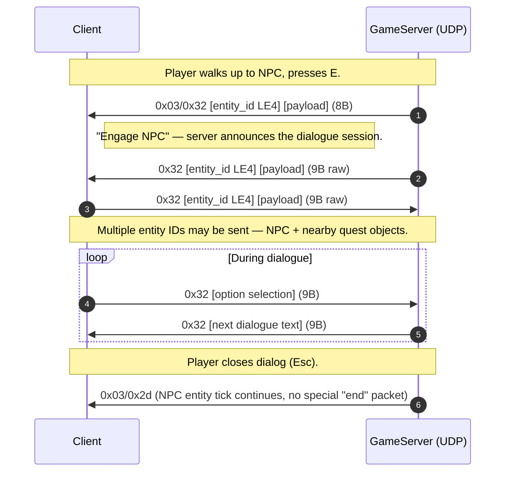
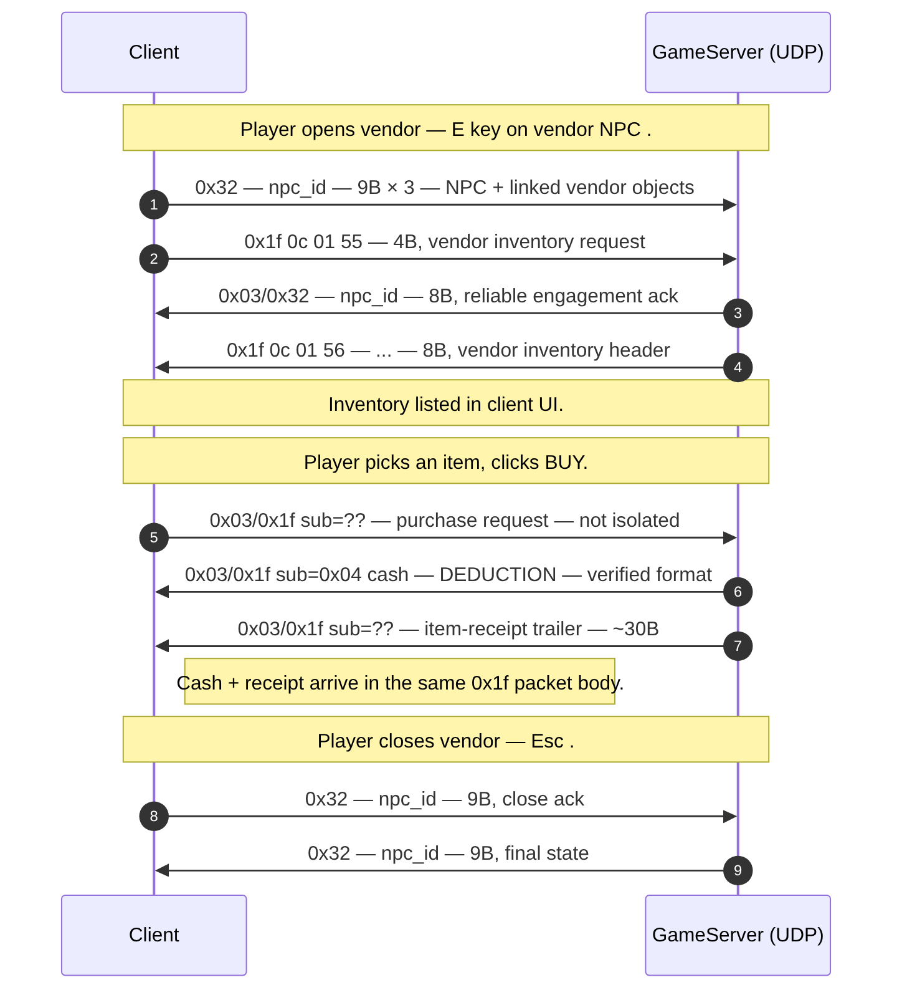

# Flow: World interactions (NPC dialogue, vendor, chair, medbed, GenRep, door, elevator, inventory)

**Status:** partial  
**Backing capture:**
`RETAIL_ZONING_AND_ITEMS_LONG_20260502_010613` is the canonical
interaction reference — 23 markers covering most interaction
primitives. Every interaction below is sourced from this capture.

## Markers in chronological order

| t (s) | Marker | Annotation |
|---:|---|---|
| 370.85 | GOGO_OPEN | "GoGo dance terminal" interaction begin |
| 382.39 | GOGO_CLOSE | end |
| 417.86 | CHAIR_SIT | sit in chair |
| 423.48 | CHAIR_STAND | stand from chair |
| 449.46 | MEDBED_USE | activate medbed |
| 460.74 | MEDBED_DONE | medbed cycle complete |
| 520.05 | TERMINAL_CITYCOM | open CityCom terminal |
| 563.69 | TERMINAL_CLOSE | close CityCom |
| 603.05 | GENREP_USE | activate Genetic Replicator (fast travel) |
| 621.38 | GENREP_LANDED | arrival at GenRep destination |
| 656.96 | GENREP_OPEN_PICK | pick destination |
| 827.78 | INVENTORY_MANAGE | open inventory + drag items |
| 841.20 | DOOR_IF | open door at IF safehouse |
| 854.10 | ELEVATOR | take elevator |
| 881.21 | NPC_TALK | open dialogue with NPC |
| 887.34 | NPC_TALK2 | dialogue option 2 |
| 891.96 | NPC_TALK3 | dialogue option 3 |
| 912.73 | NPC_VENDOR_OPEN | open vendor window |
| 929.65 | NPC_VENDOR_SELL | sell item |
| 939.02 | NPC_VENDOR_CLOSE | close vendor |

## Common primitive: "use object" packet

Pattern observed across CHAIR_SIT, MEDBED_USE, TERMINAL_CITYCOM,
DOOR_IF, ELEVATOR — the player's "interact with world object"
input takes the shape of `UDP C->S 0x03/0x1f` with **tag `0x17`**:

```
01 00 17 [data 4B]
```

(7 bytes total, with data identifying the targeted object.)
Verified by sub-tag analysis: 81 obs, all C→S, fires at every
"interact" marker. MEDBED_USE example at t=452.15:
`01 00 17 00 74 02 00` → data `00 74 02 00` (object/slot ID).

**Related new findings (2026-05-03):**

- **Tag `0x1e` (item action)** — 11B fixed C→S, fires during
  EQUIPING_*. Body: `01 00 1e [op] [src 2B] [dst 2B] [count 2B] 01 00`.
  Works WITH the `UDP 0x00` 12B inventory channel: `0x1e` is the
  high-level item action while `0x00` is the slot-level put.
- **Tag `0x26` (vendor/loot listing)** — variable-size S→C
  (10-821B). Body: `01 00 26 [entity_id LE4] [item count] [TLV item list]`.
  The same channel serves NPC vendors (NPC_VENDOR_OPEN) and
  corpse loot (LOOT marker — entity_id matches the killed mob).

See [`OPCODE_STRUCTURE.md`](../OPCODE_STRUCTURE.md) for the full
sub-tag distribution.

The server responds with a `0x03/0x1f` and `0x03/0x2d` describing
the result (chair-sit animation, medbed effect, door swing, …).

## CHAIR_SIT / CHAIR_STAND



```mermaid
sequenceDiagram
    autonumber
    participant C as Client
    participant U as GameServer (UDP)
    participant T as GameServer (TCP)

    Note over C,U: Player presses E next to a chair.
    C->>U: 0x03/0x1f sub=0x17 (use object)
    Note right of C: Identifies the chair entity.
    T->>C: 0x838f (4B "00 00 00 00") — interaction-state TCP marker
    U->>C: 0x03/0x1f sub=0x4c sit-animation tick
    Note over C,U: Player is seated. C->S 0x20 reports type=0x80 (bit 7 = "seated")
    Note over C,U: type=0x80 was unaccounted for in the bit-table; this is the bit's meaning.
    C->>U: 0x20 Movement type=0x80 (9B "20 01 00 80 [seat angle]")

    Note over C,U: Player presses Esc / W to stand.
    C->>U: 0x20 Movement type=0x7f (full update — back to walking)
    U->>C: 0x03/0x2e Weather (13B; the server replays current zone weather, sometimes)
```

Key finding: **`0x20 Movement type=0x80` is the "seated" status**
— the bit-7 field in the type bitfield that
[`packets/udp_c2s_20.md`](../packets/udp_c2s_20.md) flagged as
unknown turns out to be the chair-sit indicator.

## MEDBED_USE / MEDBED_DONE

Same "use object" pattern. The player approaches a medbed,
presses E, server runs an HP/PSI restore cycle (visible in HUD
but not yet observed at the wire level), then ends. The wall
clock is ~11s.



```mermaid
sequenceDiagram
    autonumber
    participant C as Client
    participant U as GameServer (UDP)
    participant T as GameServer (TCP)

    C->>U: 0x03/0x1f sub=0x17 [medbed_id]
    T->>C: 0x838f (interaction marker)
    U->>C: 0x03/0x1f sub=0x25 0x1b 0x01 (5B; "begin restore")
    U->>C: 0x2d ? (6B; raw outer 0x2d, not reliable)
    U->>C: 0x03/0x2d NPCData (9B; medbed entity tick)
    Note over C,U: ~11 seconds of self-pool restoration
    Note over C,U: HUD HP/PSI/STA refill — wire packets carrying the deltas not yet decoded.
    Note over C,U: MEDBED_DONE: cycle ends, player can walk away.
```

## TERMINAL_CITYCOM (CityCom kiosk)

CityCom is the in-game intranet/messaging terminal. Opening it
fires the **CityCom DCB RPC channel** `0x03/0x2b` (verified
earlier in catalog as 22-66B variable-size payload). 23 C→S
packets and 20 S→C packets observed during one CityCom session
in this capture (t=525-546, before the explicit close at 563.69).

The DCB protocol is internal — it's a request/response stream
within a single zone-level packet type. Each request has a
variable size and a request-ID byte; replies match by ID. Full
decoding requires capturing a single CityCom action with explicit
markers (e.g. send a message, list mail).

## GENREP_USE → GENREP_LANDED — Fast travel

Genetic Replicator (fast travel) **uses the same zone-handshake
protocol as a regular zone walk**, just without the client-side
Zoning1 (the server initiates the transition):





The 40B `0x03/0x23` variant `0c 00 00 00 00 00 00 00 …` is the
GenRep-specific transition trigger — it precedes the cash
deduction and zone-meta in this scenario. It's distinct from the
6B and 19B variants used by login / zone walk.

## NPC_TALK — Dialogue





The `0x32` raw outer carries dialog text/options (NOT prefixed
by the `0x03` reliable wrapper, so it's an "unreliable" channel
— consistent with chat-like data where loss is acceptable). The
`0x03/0x32` reliable variant is used to start/end the conversation.

## NPC_VENDOR_OPEN / SELL / CLOSE



```mermaid
sequenceDiagram
    autonumber
    participant C as Client
    participant U as GameServer (UDP)

    Note over C,U: Player opens vendor (E key on vendor NPC).
    C->>U: 0x32 [npc_id] (9B) × 3 (NPC + linked vendor objects)
    C->>U: 0x1f 0c 01 55 (4B; vendor inventory request)
    U->>C: 0x03/0x32 [npc_id] (8B; reliable engagement ack)
    U->>C: 0x1f 0c 01 56 [...] (8B; vendor inventory header)
    Note over C,U: Inventory listed in client UI.

    Note over C,U: Player picks an item, clicks BUY.
    C->>U: 0x03/0x1f sub=?? (purchase request — not isolated)
    U->>C: 0x03/0x1f sub=0x04 cash (DEDUCTION — verified format)
    U->>C: 0x03/0x1f sub=?? (item-receipt trailer — ~30B)
    Note right of C: Cash + receipt arrive in the same 0x1f packet body.

    Note over C,U: Player closes vendor (Esc).
    C->>U: 0x32 [npc_id] (9B; close ack)
    U->>C: 0x32 [npc_id] (9B; final state)
```

See [`vendor_buy.md`](vendor_buy.md) for the cash-carrier
byte-level breakdown.

## DOOR_IF — Open a door

Standard "use object" pattern — `0x03/0x1f sub=0x17` from
client targeting the door entity, then server emits movement
update for the door (via `0x03/0x2d` or `0x03/0x2f` UpdateModel).

The door is itself an entity in the world; its open/close state
is part of its `0x03/0x2d` body.

## ELEVATOR

Two-phase: enter-elevator (interact triggers cabin movement),
then arrive (cabin position update completes). At the wire level
this is just two `0x03/0x1f sub=0x17` interactions back-to-back
plus the elevator entity's `0x03/0x2d` ticks during travel.

## INVENTORY_MANAGE — Item drag/move

The catalog shows `UDP C->S 0x01 ?` and `UDP S->C 0x02 ?` are
strongly correlated with INVENTORY_MANAGE markers (see catalog).
The `0x01` raw outer (3B-176B variable size) carries inventory
manipulation requests; `0x02` is the ack stream. This is a
private channel for inventory operations and is not yet decoded
byte-by-byte.

## Open questions

- **`0x03/0x1f sub=0x17` exact body format.** Looks like
  `[object_id LE2] [00 00]` but variants exist (some samples
  show `00 74 02 00` = 4-byte object ID, others 2-byte).
- **GenRep destination selection packet.** GENREP_OPEN_PICK
  marker fires the destination-list UI; what packet carries the
  destination choice back to the server? Not isolated.
- **Vendor BUY action packet.** Cash deduction
  (`0x03/0x1f sub=0x04`) is verified. What does the client
  send to confirm the purchase? Likely a `0x03/0x1f` with a
  different sub-tag.
- **CityCom DCB RPC body format.** 23 C→S + 20 S→C packets
  observed at TERMINAL_CITYCOM with sizes 22–66B. Internal
  request/response with variable layout.
- **Inventory `0x01` outer body format.** Highly variable size,
  no decoded structure yet.

## Backing evidence

Full timeline at
[`_data/timelines/nc2_strace_RETAIL_ZONING_AND_ITEMS_LONG_20260502_010613.md`](../_data/timelines/nc2_strace_RETAIL_ZONING_AND_ITEMS_LONG_20260502_010613.md).
Search for marker names to find each interaction's window.
