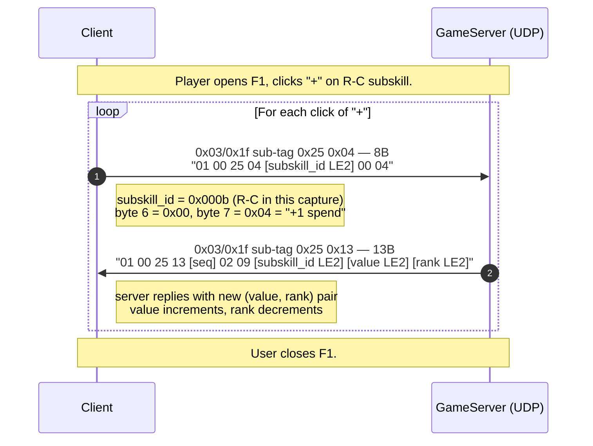

# Flow: Level up — skill point allocation

**Status:** verified  
**Backing capture:** `RETAIL_CREATION_LEVELING_LONG_20260502_160841`
— marker `LEVELUP_SUBSKILL_R-C` (t=2913.04s).

## Scenario

Player has unspent skill points (rank). Opens the F1 skill panel,
clicks the "+" button next to a subskill (R-C / Remote-Control in
this capture), spends one rank to increment that subskill's value
by one. Repeats for each click.

## Sequence diagram



## Wire format — client spend request

```
Offset  Size  Field           Sample (R-C subskill)
0x00    1     0x01            constant
0x01    1     0x00            constant
0x02    1     0x25            tag
0x03    1     0x04            sub-tag = "skill spend"
0x04    2     subskill_id LE2 0x000b (R-C / Remote-Control)
0x06    1     0x00            constant
0x07    1     0x04            spend amount (always 1 click = 0x04?)
```

The repeating pattern `01 00 25 04 0b 00 00 04` was observed at
t=2916.44, 2917.91, 2919.71, 2921.96, 2923.83, … — once per click.

## Wire format — server reply

```
Offset  Size  Field           Samples
0x00    1     0x01            constant
0x01    1     0x00            constant
0x02    1     0x25            tag
0x03    1     0x13            sub-tag = "subskill update"
0x04    1     seq             0x07, 0x08, 0x09 — increments per click
0x05    1     0x02            constant
0x06    1     0x09            sub-update tag
0x07    2     subskill_id LE2 0x000b (matches request)
0x09    2     value LE2       0x002b → 0x002c → 0x002d (43 → 44 → 45)
0x0b    2     rank LE2        0x0016 → 0x0015 → 0x0014 (22 → 21 → 20)
```

So with each click the **value goes up by 1** and the **rank
goes down by 1**. This matches the F1 UI: "rank" is unspent
points pool, "value" is the subskill's current level.

## Differential confirmation

The capture contains 5 successive spends on R-C:

| C→S sample | Server seq byte | Value | Rank |
|---|---:|---:|---:|
| `01 00 25 04 0b 00 00 04` | 0x07 | 0x002b (43) | 0x0016 (22) |
| `01 00 25 04 0b 00 00 04` | 0x08 | 0x002c (44) | 0x0015 (21) |
| `01 00 25 04 0b 00 00 04` | 0x09 | 0x002d (45) | 0x0014 (20) |

Confirms: each click decrements rank by 1 and increments value
by 1 — value+rank stays constant (subskill total).

## Subskill ID = 0x000b → R-C

The marker is `LEVELUP_SUBSKILL_R-C`. The capture confirms
subskill ID `0x000b` (= 11 decimal) maps to R-C / Remote
Control. Cross-reference against
[`charinfo_s4_subskill_table` memory](../../../../../../home/javier/.claude/projects/-home-javier-Documents-Projects-Neocron/memory/charinfo_s4_subskill_table.md)
which maps S4 positions for all 33 subskills — R-C is at
position 11 in the protocol-interleaved order. ✓

This is the FIRST direct verification of the runtime
subskill-update channel (memory previously documented S4
content delivery via CharInfo only).

## CharInfo update path

Notably, the server **does NOT push a fresh CharInfo** after a
spend. The HUD updates locally based on the per-spend `0x03/0x1f`
delta. This matches the Ghidra finding that `disc=0x01` CharInfo
guards prevent runtime redelivery.

The legacy `charsys_dead_code` memory note ("Case 0xb3 in
FULLCHARSYSTEM dispatcher is dead code") is consistent: the
client doesn't NEED a runtime CharsysInfo to update subskill
values, because the `0x03/0x1f sub=0x25/0x13` delta does it
locally.

## Open questions

- **Subskill spend amount byte.** Always `0x04` in observed
  spends. What if the user could spend multiple ranks at once?
  Would byte 7 vary? UI only allows one click at a time so we
  haven't seen it.
- **Stat (parent) point allocation.** This capture only shows
  subskill spend. Parent skills (INT/DEX/STR/CON…) would
  presumably use a different sub-tag.
- **Server-side validation.** What does the server do if the
  client sends a spend with insufficient rank? Need a
  capture where this happens (artificial — would require a
  client tweak).

## Backing evidence

Timeline:
[`_data/timelines/nc2_strace_RETAIL_CREATION_LEVELING_LONG_20260502_160841.md`](../_data/timelines/nc2_strace_RETAIL_CREATION_LEVELING_LONG_20260502_160841.md)
lines 136486-136528.
