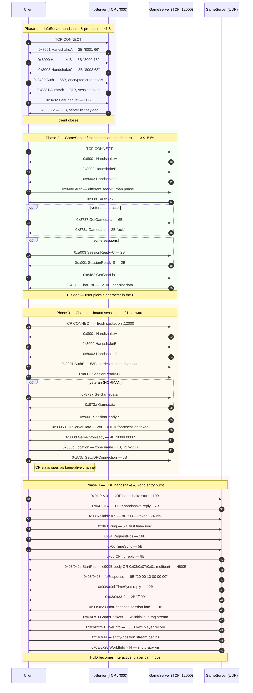

# Flow: Login → Character Select → World Entry

**Status:** verified  
**Backing captures:** every retail capture in the corpus opens with
this flow. Reference walkthroughs:
- `RETAIL_DRSTONE_20260501_172522` (fresh tutorial char, t=0..30s)
- `RETAIL_NORMAN_20260426_200458` (veteran char, t=0..30s)

## Scenario

Client establishes connections with the InfoServer and GameServer,
authenticates twice (account-level then character-level), retrieves
the character list, picks a character, and transitions to UDP
gameplay.

## Three-connection structure

Retail uses **three** sequential TCP connections, two of which go
to port 12000 (GameServer) and one to port 7000 (InfoServer):

| # | Port | Purpose | Verified at |
|---|---:|---|---|
| 1 | 7000 | InfoServer — server list / pre-auth | DRSTONE t=0.50–1.83 |
| 2 | 12000 | GameServer — get character list | DRSTONE t=3.88–5.51 |
| 3 | 12000 | GameServer — character-bound session | DRSTONE t=20.97+ |

Each connection runs the **HandshakeA/B/C** triplet (TCP `0x8001`,
`0x8000`, `0x8003`) before the application-layer exchange.

## Sequence diagram



```mermaid
sequenceDiagram
    autonumber
    participant C as Client
    participant I as InfoServer (TCP :7000)
    participant G as GameServer (TCP :12000)
    participant U as GameServer (UDP)

    rect rgb(245,245,255)
    Note over C,I: Phase 1 — InfoServer handshake & pre-auth (~1.8s)
    C->>I: TCP CONNECT
    I->>C: 0x8001 HandshakeA (3B "8001 66")
    C->>I: 0x8000 HandshakeB (3B "8000 78")
    I->>C: 0x8003 HandshakeC (3B "8003 68")
    C->>I: 0x8480 Auth (65B; encrypted credentials)
    I->>C: 0x8381 AuthAck (31B; session token)
    C->>I: 0x8482 GetCharList (30B)
    I->>C: 0x8383 ? (26B; server list payload)
    Note over C,I: client closes
    end

    rect rgb(245,255,245)
    Note over C,G: Phase 2 — GameServer first connection: get char list (~3.9–5.5s)
    C->>G: TCP CONNECT
    G->>C: 0x8001 HandshakeA
    C->>G: 0x8000 HandshakeB
    G->>C: 0x8003 HandshakeC
    C->>G: 0x8480 Auth (different seed/IV than phase 1)
    G->>C: 0x8381 AuthAck
    opt veteran character
        C->>G: 0x8737 GetGamedata (6B)
        G->>C: 0x873a Gamedata (2B "ack")
    end
    opt some sessions
        C->>G: 0xa003 SessionReady-C (2B)
        G->>C: 0xa001 SessionReady-S (2B)
    end
    C->>G: 0x8482 GetCharList
    G->>C: 0x8385 CharList (~210B; per-slot data)
    Note over C,G: ~15s gap — user picks a character in the UI
    end

    rect rgb(255,250,240)
    Note over C,G: Phase 3 — Character-bound session (~21s onward)
    C->>G: TCP CONNECT (fresh socket on :12000)
    G->>C: 0x8001 HandshakeA
    C->>G: 0x8000 HandshakeB
    G->>C: 0x8003 HandshakeC
    C->>G: 0x8301 AuthB (53B; carries chosen char slot)
    C->>G: 0xa003 SessionReady-C
    opt veteran (NORMAN)
        C->>G: 0x8737 GetGamedata
        G->>C: 0x873a Gamedata
    end
    G->>C: 0xa001 SessionReady-S
    G->>C: 0x8305 UDPServerData (28B; UDP IP/port/session token)
    G->>C: 0x830d GameinfoReady (4B "830d 0000")
    G->>C: 0x830c Location (zone name + ID, ~27–35B)
    C->>G: 0x873c GetUDPConnection (6B)
    Note right of C: TCP stays open as keep-alive channel
    end

    rect rgb(255,245,245)
    Note over C,U: Phase 4 — UDP handshake & world entry burst
    C->>U: 0x01 ? × 3 (UDP handshake start, ~10B)
    U->>C: 0x04 ? × 4 (UDP handshake reply, ~7B)
    C->>U: 0x03 Reliable × 5 (8B "03 [token] 0240da")
    C->>U: 0x0b CPing (5B; first time-sync)
    C->>U: 0x2a RequestPos (16B)
    C->>U: 0x0c TimeSync (5B)
    U->>C: 0x0b CPing reply (9B)
    U->>C: 0x03/0x2c StartPos (≤900B body) OR 0x03/0x07/0x01 multipart (>900B)
    U->>C: 0x03/0x23 InfoResponse (6B "20 00 10 00 00 00")
    U->>C: 0x03/0x0d TimeSync reply (12B)
    U->>C: 0x03/0x33 ? (2B "ff 00")
    U->>C: 0x03/0x23 InfoResponse session-info (10B)
    U->>C: 0x03/0x1f GamePackets (5B initial sub-tag stream)
    U->>C: 0x03/0x25 PlayerInfo (~65B own player record)
    U->>C: 0x1b × N (entity-position stream begins)
    U->>C: 0x03/0x28 WorldInfo × N (entity spawns)
    Note over C,U: HUD becomes interactive; player can move
    end
```

## Phase-by-phase byte annotations

### Phase 1 — InfoServer (port 7000)

| Byte sequence | Notes |
|---|---|
| `0x8001 66` | server hello — second byte is per-connection nonce/version (`0x66`) |
| `0x8000 78` | client hello — second byte is paired nonce (`0x78`) |
| `0x8003 68` | "ready for auth" — second byte may be acknowledging the nonce |
| `0x8480 [29 23 be 84 e1 6c d6 ae] [28 03 01 b0 25 63 8a 73 86 29 f6 00 00] …` | Auth with 65B body. First 8 bytes after opcode look like an encrypted password seed; remainder is account ID block. **The `28 03 01 b0 25 63 8a 73 86 29 f6 00 00` portion is identical across all retail captures and across both phase-1 and phase-2 Auth packets** — it's an account-derived constant. |
| `0x8381 [token LE2 = 0x1a7f or 0xbd7e] 00 00 00 00 00 12 00 [c2 99 99 …]` | AuthAck. Bytes 2-3 are a per-session token that subsequent packets echo back. |
| `0x8482 [token] 01 00 [01 00] 1e 00 …` | GetCharList. The byte at offset 5 is `01` in phase 1 and `06` in phase 2 (some "scope" flag). |
| `0x8383 01 00 0e 00 [token-ish 4B] e0 2e 00 00 06 04 [00\|03] 00 07 00 "tita\\0"` | InfoServer reply — looks like a server entry record ("tita…" likely server name). Format not yet decoded byte-by-byte. |

### Phase 2 — GameServer first connection

Same opcodes as phase 1, except:
- The Auth body's first 8 bytes are different (different IV/seed) but the trailing constant `28 03 01 b0 25 63 …` is identical → keyed on the account.
- `0x8385` CharList replaces phase 1's stub `0x8383`. Body is 209-225 bytes carrying per-slot character previews.
- Optional: `0x8737 GetGamedata` / `0x873a Gamedata` exchange — present for veteran characters (NORMAN, AUGUSTO), absent for fresh DRSTONE captures.
- Optional: `0xa003 SessionReady-C` / `0xa001 SessionReady-S` — modern NCE 2.5.x clients send/expect this; older clients may skip it.

### Phase 3 — Character-bound session

This is a NEW TCP connection (the previous one was closed; client opens a fresh socket on :12000).

- `0x8301 AuthB` (53B) replaces `0x8480 Auth`. Carries the selected character slot.
- `0x8305 UDPServerData` (28B) carries the UDP server IP, port, and a per-session token used to identify the player on the UDP channel.
- `0x830d GameinfoReady` (4B `830d 0000`) signals the server is ready to receive UDP traffic.
- `0x830c Location` carries the zone name (variable-length string) and zone ID.

### Phase 4 — UDP handshake

The client immediately fires three `0x01 ? (10B)` packets to the UDP port given in `0x8305`. The server replies with three to four `0x04 ? (7B)` packets. These appear to be the UDP-channel handshake; their exact meaning is not yet decoded (they're sent BEFORE the cipher's per-packet seed is reset to a known value).

After UDP handshake, the client begins normal traffic: `0x0b CPing`,
`0x2a RequestPos`, `0x0c TimeSync`. Server responds with the
**world-entry burst** (CharInfo / WorldInfo / entity stream) which
is detailed in the per-flow docs.

## Open questions

- **`0x8383`** body format. Looks like a server-list record but
  hasn't been parsed.
- **UDP handshake `0x01` / `0x04`** opcodes. Their byte format is
  observed but their meaning isn't decoded — they appear before
  cipher state stabilizes.
- **`0x873c GetUDPConnection`** — sent by some captures but not
  others. NORMAN sends it; DRSTONE doesn't. Trigger is unclear.
- **InfoServer `0x8383` size** is always 26 bytes regardless of
  capture. Suggests one server in the response list.
- **Why two `0x8480 Auth` exchanges?** Phase 1 (InfoServer) and
  phase 2 (GameServer) both send Auth with the same account
  block. Two-stage authentication is unusual; possibly the server
  implements a unified backend and the InfoServer connection is
  legacy.

## Related captures

Login is present in **every** capture in the corpus. For
deeper analysis open the timeline at
[`_data/timelines/`](../_data/timelines/) and look at t=0..30s.
