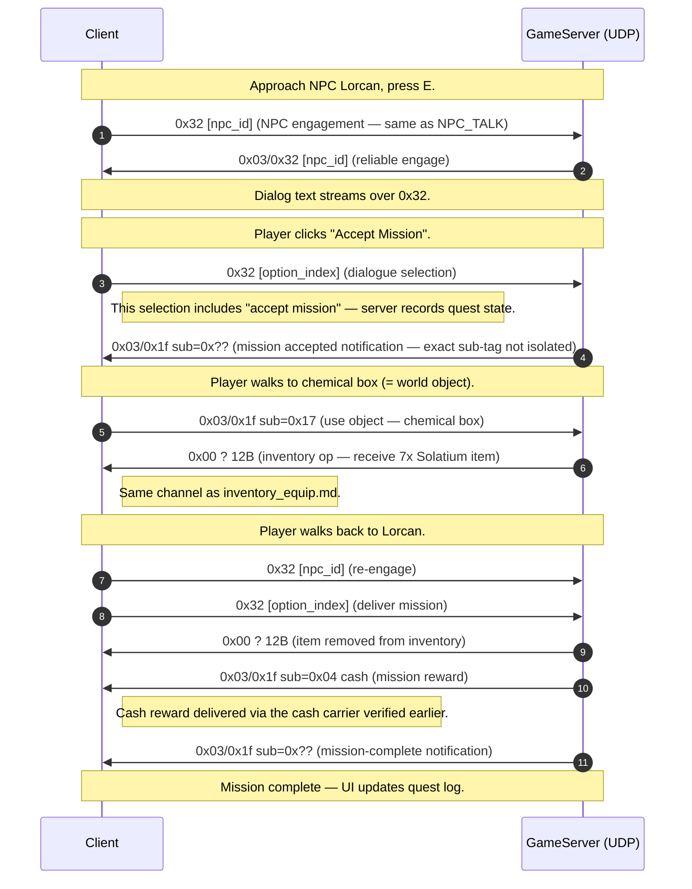

# Flow: Mission flow (NPC quest accept → progress → complete)

**Status:** partial  
**Backing capture:** `RETAIL_CREATION_LEVELING_LONG_20260502_160841`
— markers `OUTSIDE_AREAM5_TALK_NPCLORCAN`,
`OUTSIDE_AREAM5_GOT_MISSION`,
`OUTSIDE_AREAM5_OPENING_CHEMICALBOX`,
`OUTSIDE_AREAM5_TAKING_7XSOLATIUM_FROM_CHEMICALBOX`,
`OUTSIDE_AREAM5_DELIVERYING_MISSION_LORCAN`,
`OUTSIDE_AREAM5_MISSION_COMPLETE`,
`OUTSIDE_AREAM5_TALKING_EZRA_MISSION_2`,
`OUTSIDE_AREAM5_TALKING_EZRA_MISSION_ACCEPTED_KILL`,
`OUTSIDE_AREAM5_TALKING_TASHA_MISSION_*`,
`OUTSIDE_AREAM5_TALKING_GEORDI_MISSION_*`.

## Scenario

Player talks to a quest-giver NPC (Lorcan, Ezra, Tasha, Geordi),
accepts a mission ("get N items from box", "kill X mob",
"deliver item to Y NPC"), completes the objective, returns to
the quest-giver, and receives a reward.

## Identified packet types (updated 2026-05-03)

Sub-tag analysis (`tools/subtag_analysis.py`) revealed that
mission flow has two **dedicated tags** within `0x03/0x1f`:

### Tag `0x1a` — dialogue navigation

**Direction:** mixed (C→S option pick, S→C option response)  
**Size:** 4-22B variable

| Direction | Size | Body | Meaning |
|---|---:|---|---|
| C→S | 4 | `01 00 1a 01` | "click dialogue option 1" |
| S→C | 6 | `01 00 1a [option_id] 00 00` | "next dialogue node = option_id" |
| S→C | 10 | `01 00 1a 00 00 01 00 00 80 3f` | dialogue init (float 1.0 = full progress?) |

189 obs across captures, strongly correlated with NPC dialog
markers and mission completion clicks.

### Tag `0x2a` — mission grant / state update

**Direction:** S→C only  
**Size:** 58-64 bytes  
**Body shape:**

```
01 00 2a [version 1B] 01 00 00 [uid LE3] 12 [mission_id ASCII null-padded to 16B] [state ~30B]
```

Decoded mission IDs from CREATION_LEVELING_LONG:

| ASCII string | NPC | Marker prefix |
|---|---|---|
| `mc5_lorcan` | Lorcan | OUTSIDE_AREAM5_TALK_NPCLORCAN |
| `mc5_ezra` | Ezra | OUTSIDE_AREAM5_TALKING_EZRA_* |
| `mc5_tasha` | Tasha | OUTSIDE_AREAM5_TALKING_TASHA_* |
| `mc5_geordi` | Geordi | OUTSIDE_AREAM5_TALKING_GEORDI_* |

**Convention:** mission IDs are ASCII strings of the form
`<area>_<npc>` where `<area>` is the zone code (mc5 = Military
Command 5 / AreaMC5). The string is prefixed by `0x12` (length
byte? = 18, but mission strings are ≤ 11 chars + nulls). Stored
in a 16-byte field starting at body offset 11.

This is the **server-side quest log update** — the server pushes
the current mission state at intervals during an active mission.

## Other channels also used

Mission flow ALSO rides on standard NPC dialogue channels (see
[`interactions.md` § NPC_TALK](interactions.md#npc_talk--dialogue)):

- `0x32` (raw outer) — NPC dialogue text + option selection
- `0x03/0x32` (reliable) — dialogue session begin/end
- `0x03/0x1f tag=0x25 sub=0x13` — state delta wrapper for
  reward delivery (cash carrier)

So mission flow uses TWO dedicated tags PLUS the general dialogue
infrastructure.

## Sequence diagram



## Mission-state delivery

The capture shows ~30 mission-related markers (4 quest-givers,
3 missions each plus follow-ups). All of them produce traffic
that's structurally indistinguishable from ordinary NPC
interaction except for two patterns that fire near
`MISSION_COMPLETE` markers:

1. **A long-burst `0x03/0x1f` GamePackets sub-tag stream** —
   appears to be the server emitting state deltas for quest log
   updates and faction sympathy changes. Sub-tags vary across
   markers, no single "mission complete" tag isolated yet.
2. **Cash deduction or reward via `0x03/0x1f sub=0x04`** —
   verified format (cash carrier). Appears for paid missions.

## Mission item delivery

When the mission requires receiving an item (e.g. "7x
Solatium" from the chemical box at marker
`TAKING_7XSOLATIUM_FROM_CHEMICALBOX`), the server uses the
**inventory channel** (`0x00 ?` 12B, see
[`inventory_equip.md`](inventory_equip.md)) to push the items
into the player's inventory. Same channel as opening any
container or looting any corpse — there's no mission-specific
item channel.

## Open questions

- **Mission accept signal.** Which `0x32`/`0x03/0x32` byte
  carries "I accept" vs "I decline"? Looks like the option-index
  byte in the C→S `0x32` body, but the option enum isn't
  decoded.
- **Server-side quest log.** Where does the client receive the
  current quest list / progress? On login, the CharInfo body
  presumably includes it (Section 5 or 6 — inventory-adjacent),
  but runtime updates are unclear.
- **Mission types** (kill X / deliver Y / collect Z) — same
  protocol path but different completion checks. We have one of
  each in this capture but byte-level isolation requires
  per-mission-type captures.
- **Faction sympathy delta** on mission complete. Should fire
  but the exact sub-tag isn't isolated.

## Backing evidence

Timeline:
[`_data/timelines/nc2_strace_RETAIL_CREATION_LEVELING_LONG_20260502_160841.md`](../_data/timelines/nc2_strace_RETAIL_CREATION_LEVELING_LONG_20260502_160841.md).
Mission markers span lines 12000-114000 (4 quest-givers ×
multiple missions).
