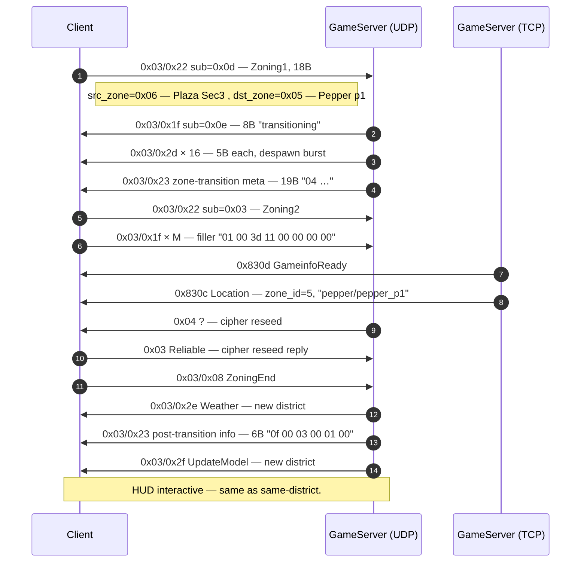
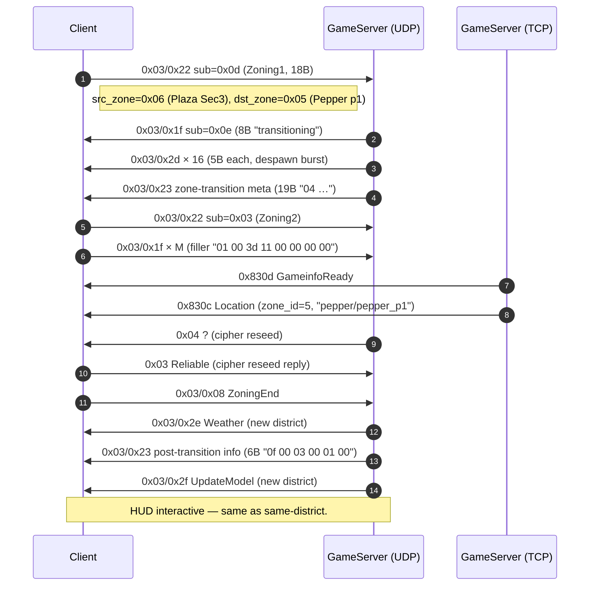
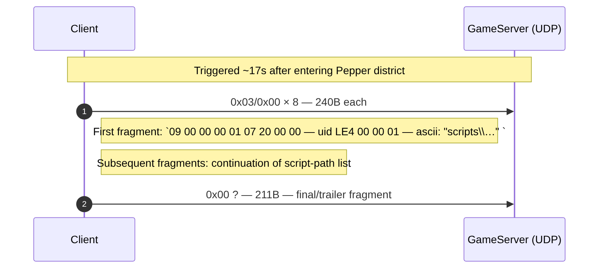
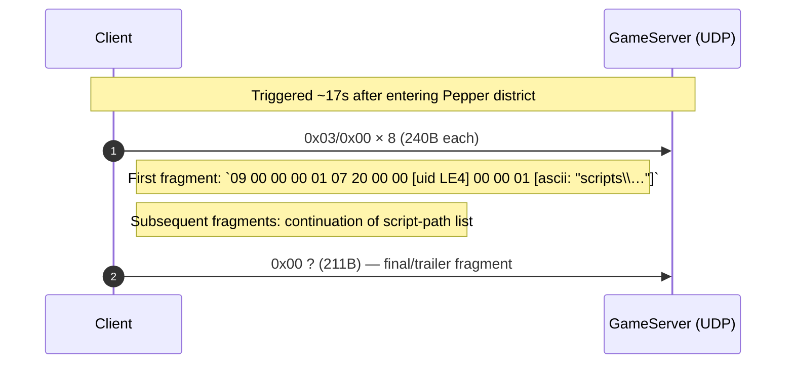

# Flow: Cross-district zone walk (Plaza → Pepper)

**Status:** verified  
**Backing capture:**
`RETAIL_PLAZA_TO_PEPPER_CROSS_DISTRICT_20260502_103513` —
markers `BEFORE_CROSS` (140.25s), `AFTER_CROSS` (156.27s),
`AFTER_END` (175.66s).

## Scenario

Player walks across a city-district boundary (Plaza Sec3 →
Pepper p1). Same protocol-level handshake as same-district walks
(see [`zone_walk_same_district.md`](zone_walk_same_district.md))
plus a **post-transition script-list upload** that does not appear
in same-district walks.

## What's the same as a same-district walk

The core zoning sequence is byte-for-byte identical:

This phase took ~1.16s wall-clock from Zoning1 (t=144.21) to
ZoningEnd (t=145.37) — same order of magnitude as same-district.

## What's different from same-district

### 1. Despawn burst is larger

| Walk | Despawn count |
|---|---:|
| Same-district (Pepper p3 → p2) | 14 entities |
| Cross-district (Plaza → Pepper) | 16 entities |

Bigger because Plaza Sec3 has a denser entity population (more
NPCs visible at the moment of crossing) than Pepper p3. Not a
protocol difference — same packet shape (`0x03/0x2d` 5B each).

### 2. Post-transition script-list upload (CRITICAL FINDING)

~17 seconds AFTER `AFTER_CROSS` (at t=162.95), the client emits
a burst of 8× `0x03/0x00` C→S packets, each 240 bytes, plus a
trailing 211B `0x00 ?` packet. Total: ~2131 bytes uploaded to
the server.

This burst is **not observed** in same-district walks
(`RETAIL_ZONING_AND_ITEMS_LONG` has 4 zone walks, none triggers
it). The first fragment payload contains the ASCII string
`scripts\` in plain text — strongly suggests this is the client
uploading a manifest of loaded scripts, perhaps so the
district's authority can validate/diff against what's expected.

### 3. (Login-time only) `0x03/0x07/0x38` multipart

A multipart with discriminator `0x38` is observed at t=61.79
during this capture's *login* (not during the zone walk).
Initially flagged as a candidate cross-district indicator; on
closer inspection it's character-specific login data unrelated
to the zone walk. See
[`packets/udp_s2c_03_07_38.md`](../packets/udp_s2c_03_07_38.md)
for the open question on what disc=0x38 means.

## Annotated walkthrough — `BEFORE_CROSS` to `AFTER_END`

| t (s) | Δ ms | Dir | Packet | Sz | Annotation |
|---:|---:|---|---|---:|---|
| **140.25** | — | — | — | — | **▸ BEFORE_CROSS marker** (user manually placed) |
| ~144.13 | — | S→C | `0x1b` × 30+ | 19 | (steady-state entity stream) |
| **144.21** | — | C→S | `0x03/0x22 sub=0x0d` | 18 | **Zoning1** — src=0x06, dst=0x05 |
| 144.33 | 118 | S→C | `0x03/0x1f` | 5 | sub=0x33 heartbeat (different from same-district 0x1a) |
| 144.33 | 0 | S→C | `0x03/0x2d` × 2 | 54 | last NPC behavior tick before despawn |
| 144.63 | 304 | S→C | `0x03/0x1f sub=0x0e` | 8 | "transitioning" |
| 144.63 | 0 | S→C | `0x03/0x2d` × 16 | 5 each | **Despawn burst** |
| 144.63 | 0 | S→C | `0x03/0x23` | 19 | **Zone-transition meta** |
| **144.67** | 36 | C→S | `0x03/0x22 sub=0x03` | 18 | **Zoning2** — confirm |
| 144.70 | 32 | S→C | `0x838f` | 7 | TCP keepalive (4 bytes payload `00 00 00 00`) |
| 144.70 | 4 | C→S | `0x32` | 9 | dialogue-channel close (left-over from prior NPC interaction) |
| **144.88** | 63 | S→C | `0x830d` | 4 | TCP GameinfoReady |
| **145.35** | 466 | S→C | `0x830c` | 31 | TCP Location: zone_id=5, "pepper/pepper_p1" |
| 145.35 | 0 | S→C | `0x04 ?` | 7 | UDP cipher reseed |
| 145.35 | 0 | C→S | `0x03 Reliable` | 8 | UDP cipher reseed reply |
| **145.37** | 17 | C→S | `0x03/0x08` | 2 | **ZoningEnd** "00 00" |
| 145.55 | 185 | S→C | `0x03/0x2e` | 13 | new-zone Weather |
| 145.55 | 0 | S→C | `0x03/0x23` | 6 | post-transition info "0f 00 03 00 01 00" |
| 145.55 | 0 | S→C | `0x1f ?` | 14 | zone metadata |
| 145.55 | 0 | S→C | `0x03/0x2f` | 68 | UpdateModel re-sync |
| 145.56 | 11 | S→C | `0x03/0x09` | 2 | "03 00" |
| **156.27** | — | — | — | — | **▸ AFTER_CROSS marker** (~10s after BSP load) |
| ~157.00 | — | various | — | — | (steady-state movement / NPC stream) |
| **162.95** | — | C→S | `0x03/0x00` × 8 | 240 each | **Script-list upload begins** (CRITICAL FINDING) |
| 162.95 | 0 | C→S | `0x03/0x00` | 240 | continuation: contains string `scripts\…` |
| 163.04 | 82 | C→S | `0x00 ?` | 211 | final upload fragment |
| **175.66** | — | — | — | — | **▸ AFTER_END marker** |

## Open questions

- **`0x03/0x00` 240B fragments**: confirmed format starts with
  `09 00 00 00 01 07 20 00 00 [uid LE4] 00 00 01 …` then ASCII
  `scripts\…`. What's the full body grammar? Likely a list of
  filename strings; needs decoding.
- Why does this upload fire ~17s AFTER the zone change
  completes? Server-pushed event triggers it? Or client timer?
- Does it fire on EVERY cross-district transition, or only when
  scripts genuinely differ between districts? Need more
  cross-district captures (Plaza→Outzone, Pepper→TechHaven, …).
- Note: `0x03/0x00` is structurally similar to `0x03/0x07`
  multipart but uses sub-opcode `0x00`. Should be added to
  `MULTIPART_CHANNELS` once we confirm the per-fragment header
  format.

## Backing evidence

Full timeline:
[`_data/timelines/nc2_strace_RETAIL_PLAZA_TO_PEPPER_CROSS_DISTRICT_20260502_103513.md`](../_data/timelines/nc2_strace_RETAIL_PLAZA_TO_PEPPER_CROSS_DISTRICT_20260502_103513.md).
The `0x03/0x00` upload is at lines 8171-8179.
