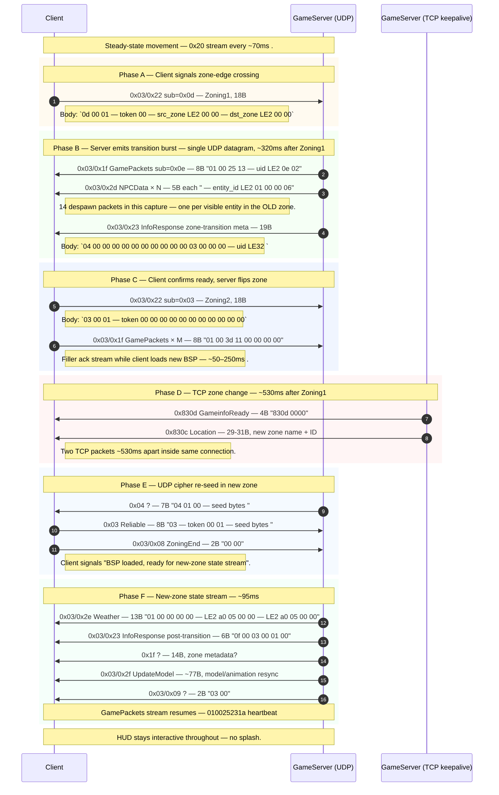

# Flow: Same-district zone walk (smooth, no splash)

**Status:** verified  
**Backing capture:** `RETAIL_ZONING_AND_ITEMS_LONG_20260502_010613`
— markers `WALK_TO_PEPPERPARK_2` (227.4s) and
`WALK_TO_PEPPERPARK_1` (292.3s). Walkthrough below references the
first walk; the second is identical in structure.

## Scenario

The player walks across a zone-edge inside a city district
(Pepper p3 → p2 → p1). The client does NOT show the
"Synchronizing" loading splash and does NOT teleport the player;
the BSP is swapped behind the scenes and gameplay continues
seamlessly.

## Sequence diagram



```mermaid
sequenceDiagram
    autonumber
    participant C as Client
    participant U as GameServer (UDP)
    participant T as GameServer (TCP keepalive)

    Note over C,U: Steady-state movement (0x20 stream every ~70ms).

    rect rgb(255,250,240)
    Note over C,U: Phase A — Client signals zone-edge crossing
    C->>U: 0x03/0x22 sub=0x0d (Zoning1, 18B)
    Note right of C: Body: `0d 00 01 [token] 00 [src_zone LE2] 00 00 [dst_zone LE2] 00 00`
    end

    rect rgb(245,255,245)
    Note over C,U: Phase B — Server emits transition burst (single UDP datagram, ~320ms after Zoning1)
    U->>C: 0x03/0x1f GamePackets sub=0x0e (8B "01 00 25 13 [uid LE2] 0e 02")
    U->>C: 0x03/0x2d NPCData × N (5B each "[entity_id LE2] 01 00 00 06")
    Note right of C: 14 despawn packets in this capture — one per visible entity in the OLD zone.
    U->>C: 0x03/0x23 InfoResponse zone-transition meta (19B)
    Note right of C: Body: `04 00 00 00 00 00 00 00 00 00 00 03 00 00 00 [uid LE32]`
    end

    rect rgb(240,245,255)
    Note over C,U: Phase C — Client confirms ready, server flips zone
    C->>U: 0x03/0x22 sub=0x03 (Zoning2, 18B)
    Note right of C: Body: `03 00 01 [token] 00 00 00 00 00 00 00 00 00 00 00`
    C->>U: 0x03/0x1f GamePackets × M (8B "01 00 3d 11 00 00 00 00")
    Note right of C: Filler ack stream while client loads new BSP (~50–250ms).
    end

    rect rgb(255,245,245)
    Note over C,T: Phase D — TCP zone change (~530ms after Zoning1)
    T->>C: 0x830d GameinfoReady (4B "830d 0000")
    T->>C: 0x830c Location (29-31B; new zone name + ID)
    Note right of C: Two TCP packets ~530ms apart inside same connection.
    end

    rect rgb(245,250,255)
    Note over C,U: Phase E — UDP cipher re-seed in new zone
    U->>C: 0x04 ? (7B "04 01 00 [seed bytes]")
    C->>U: 0x03 Reliable (8B "03 [token] 00 01 [seed bytes]")
    C->>U: 0x03/0x08 ZoningEnd (2B "00 00")
    Note right of C: Client signals "BSP loaded, ready for new-zone state stream".
    end

    rect rgb(245,255,250)
    Note over C,U: Phase F — New-zone state stream (~95ms)
    U->>C: 0x03/0x2e Weather (13B "01 00 00 00 00 [LE2 a0 05] 00 00 [LE2 a0 05] 00 00")
    U->>C: 0x03/0x23 InfoResponse post-transition (6B "0f 00 03 00 01 00")
    U->>C: 0x1f ? (14B; zone metadata?)
    U->>C: 0x03/0x2f UpdateModel (~77B; model/animation resync)
    U->>C: 0x03/0x09 ? (2B "03 00")
    Note over C,U: GamePackets stream resumes (010025231a heartbeat)
    end

    Note over C,U: HUD stays interactive throughout — no splash.
```

## Annotated walkthrough — `WALK_TO_PEPPERPARK_2` @ t=227.4s
(actual zone-edge crossing at t=235.48s; user marker preceded crossing)

| t (s) | Δ ms | Dir | Packet | Sz | Annotation |
|---:|---:|---|---|---:|---|
| **235.48** | — | C→S | `0x03/0x22 sub=0x0d` | 18 | **Zoning1**: client crossed zone edge |
| 235.57 | 96 | S→C | `0x1b ?` × 2 | 19 | (residual NPC stream from old zone) |
| 235.80 | 229 | S→C | `0x03/0x1f sub=0x0e` | 8 | "transitioning" sub-tag |
| 235.80 | 0 | S→C | `0x03/0x2d` × 14 | 5 each | **Despawn burst** for old-zone entities |
| 235.80 | 0 | S→C | `0x03/0x23` | 19 | **Zone-transition meta** (`04 …`) |
| **235.84** | 35 | C→S | `0x03/0x22 sub=0x03` | 18 | **Zoning2**: client confirms, BSP loading |
| 235.88…235.99 | — | C→S | `0x03/0x1f` × 9 | 8 | "loading" filler stream |
| **236.04** | 45 | S→C TCP | `0x830d` | 4 | GameinfoReady |
| **236.57** | 536 | S→C TCP | `0x830c` | 31 | **Location**: zone_id=6, name="pepper/pepper_p2" |
| 236.57 | 0 | S→C | `0x04 ?` | 7 | UDP cipher re-seed |
| 236.58 | 6 | C→S | `0x03 Reliable` | 8 | UDP re-seed reply |
| **236.58** | 2 | C→S | `0x03/0x08` | 2 | **ZoningEnd**: BSP loaded |
| 236.67 | 91 | S→C | `0x03/0x2e` | 13 | Weather for new zone |
| 236.67 | 0 | S→C | `0x03/0x23` | 6 | post-transition session info (`0f 00 03 00 01 00`) |
| 236.67 | 0 | S→C | `0x1f ?` | 14 | zone metadata? |
| 236.67 | 0 | S→C | `0x03/0x2f` | 77 | UpdateModel re-sync |

The whole transition takes ~1.1s wall-clock from Zoning1 to
ZoningEnd, of which ~530ms is the BSP load on the client (the gap
between `0x830d` and `0x830c`).

## Despawn burst format

Each old-zone entity gets one 5-byte `0x03/0x2d` packet:

```
Offset  Size  Field         Value (sample)
0x00    2     entity_id     LE2 (e.g. 0x011b)
0x02    2     0x0001        constant
0x04    1     0x06          despawn opcode
```

For the `WALK_TO_PEPPERPARK_2` walk the burst contained 14
entities (`0x011b, 0x0125, 0x012d, 0x0136, 0x0138, 0x0139,
0x013a, 0x013b, 0x013c, 0x013d, 0x013e, 0x0145, 0x0148, 0x0149`).
This is one packet per visible NPC the client had spawned in the
old zone.

## Zone-transition meta format (`0x03/0x23` 19B variant)

```
Offset  Size  Field             Notes
0x00    1     0x04              variant tag (vs. 0x20 zone-info or 0x0e session-info)
0x01    7     0x00 × 7
0x08    3     0x00 × 3
0x0b    4     0x03 00 00 00     transition phase = 3?
0x0f    4     uid LE4           player UID (matches AuthB)
```

This one packet is what the client uses to know "the despawn
burst is over, send Zoning2 now". Without it, the client never
sends Zoning2 and falls through to a TCP timeout (visible as the
"Synchronizing" splash in Ceres-J's current implementation).

## Zoning1 (`0x03/0x22 sub=0x0d`) format

```
Offset  Size  Field            Notes
0x00    1     0x0d             sub-opcode
0x01    1     0x00
0x02    2     token LE2        per-session, mirrors AuthB token
0x04    2     0x00 0x00
0x06    2     src_zone LE2     current zone (the one being LEFT)
0x08    2     0x00 0x00
0x0a    2     dst_zone LE2     destination zone (the one being ENTERED)
0x0c    6     0x00 × 6
```

In the walked example: src_zone = `0x0006` → dst_zone = `0x0007`
(or vice versa — needs cross-checking against the current
zone-id when the marker fired).

## Zoning2 (`0x03/0x22 sub=0x03`) format

```
Offset  Size  Field            Notes
0x00    1     0x03             sub-opcode = ready
0x01    1     0x00
0x02    2     token LE2
0x04    14    0x00 × 14        always zero
```

Pure ack — no payload data. The token in bytes 2-3 binds the
ack to the prior Zoning1.

## Open questions

- The 8B `0x03/0x1f sub=0x0e` packet at the start of phase B
  contains a UID/token in bytes 4-5 and `0e 02` after. What does
  this signal? Possibly "transition begin" event.
- After Zoning2, the client streams 9× `01 00 3d 11 00 00 00 00`
  GamePackets while loading the new BSP. The `3d 11` sub-tag
  pair appears unique to this state — what does it mean?
  ("waiting for zone state"?)
- The new-zone `0x03/0x2f` UpdateModel (~77B) replays the
  player's model/animation state. Format same as runtime
  UpdateModel?

## Backing evidence

Full timeline at
[`_data/timelines/nc2_strace_RETAIL_ZONING_AND_ITEMS_LONG_20260502_010613.md`](../_data/timelines/nc2_strace_RETAIL_ZONING_AND_ITEMS_LONG_20260502_010613.md).
Search for `0x03/0x22` to find all four zone walks in this
capture (lines 14643, 14662, 20678, 20685, 36011, 39709…).
