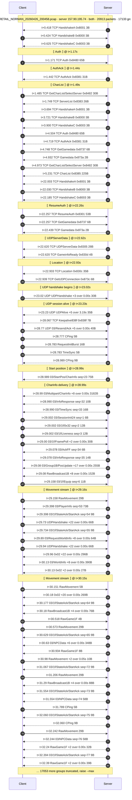

```mermaid
sequenceDiagram
    autonumber
    participant C as Client
    participant S as Server
    Note over C,S: nc2_strace_RETAIL_NORMAN_20260426_200458.pcap · server 157.90.195.74 · both · 20913 packets · 17133 groups · 411.5s
    S-->>C: t+0.418 TCP HandshakeA 0x8001 3B
    C->>S: t+0.424 TCP HandshakeB 0x8000 3B
    S-->>C: t+0.625 TCP HandshakeC 0x8003 3B
    Note over C,S: ⟦ Auth ⟧ @ t+1.17s
    C->>S: t+1.171 TCP Auth 0x8480 65B
    Note over C,S: ⟦ AuthAck ⟧ @ t+1.44s
    S-->>C: t+1.442 TCP AuthAck 0x8381 31B
    Note over C,S: ⟦ CharList ⟧ @ t+1.49s
    C->>S: t+1.485 TCP GetCharList/SelectServer 0x8482 30B
    S-->>C: t+1.749 TCP ServerList 0x8383 26B
    S-->>C: t+3.694 TCP HandshakeA 0x8001 3B
    C->>S: t+3.721 TCP HandshakeB 0x8000 3B
    S-->>C: t+3.900 TCP HandshakeC 0x8003 3B
    C->>S: t+4.504 TCP Auth 0x8480 65B
    S-->>C: t+4.719 TCP AuthAck 0x8381 31B
    C->>S: t+4.748 TCP GetGamedata 0x8737 6B
    S-->>C: t+4.932 TCP Gamedata 0x873a 2B
    C->>S: t+4.973 TCP GetCharList/SelectServer 0x8482 30B
    S-->>C: t+5.231 TCP CharList 0x8385 225B
    S-->>C: t+22.003 TCP HandshakeA 0x8001 3B
    C->>S: t+22.030 TCP HandshakeB 0x8000 3B
    S-->>C: t+22.185 TCP HandshakeC 0x8003 3B
    Note over C,S: ⟦ ResumeAuth ⟧ @ t+22.26s
    C->>S: t+22.257 TCP ResumeAuth 0x8301 53B
    C->>S: t+22.257 TCP GetGamedata 0x8737 6B
    S-->>C: t+22.439 TCP Gamedata 0x873a 2B
    Note over C,S: ⟦ UDPServerData ⟧ @ t+22.62s
    S-->>C: t+22.620 TCP UDPServerData 0x8305 28B
    S-->>C: t+22.620 TCP GameinfoReady 0x830d 4B
    Note over C,S: ⟦ Location ⟧ @ t+22.93s
    S-->>C: t+22.933 TCP Location 0x830c 35B
    C->>S: t+22.939 TCP GetUDPConnection 0x873c 6B
    Note over C,S: ⟦ UDP handshake begins ⟧ @ t+23.02s
    C->>S: t+23.02 UDP UDPHandshake ×3 over 0.00s 30B
    Note over C,S: ⟦ UDP session alive ⟧ @ t+23.23s
    S-->>C: t+23.23 UDP UDPAlive ×5 over 3.19s 35B
    S-->>C: t+28.067 TCP Keepalive838f 0x838f 7B
    C->>S: t+28.77 UDP 03/Resend/Ack ×5 over 0.00s 40B
    C->>S: t+28.777 CPing 5B
    C->>S: t+28.783 RequestInitBurst 16B
    C->>S: t+28.783 TimeSync 5B
    S-->>C: t+28.989 CPing 9B
    Note over C,S: ⟦ Start position ⟧ @ t+28.99s
    S-->>C: t+28.989 03/StartPos/CharInfo seq=23 75B
    Note over C,S: ⟦ CharInfo delivery ⟧ @ t+28.99s
    S-->>C: t+28.99 03/Multipart/CharInfo ×8 over 0.00s 3182B
    S-->>C: t+28.990 03/InfoResponse seq=32 10B
    S-->>C: t+28.990 03/TimeSync seq=33 16B
    C->>S: t+29.002 03/SessionInit24 seq=1 6B
    C->>S: t+29.002 03/1f/0x32 seq=2 12B
    C->>S: t+29.002 03/1f/Liveness seq=3 12B
    C->>S: t+29.00 03/1f/FramePoll ×2 over 0.00s 30B
    S-->>C: t+29.078 03/AckFF seq=34 6B
    S-->>C: t+29.078 03/InfoResponse seq=35 14B
    S-->>C: t+29.08 03/Group1B/PosUpdate ×17 over 0.00s 255B
    S-->>C: t+29.08 RawBroadcast1B ×8 over 0.00s 152B
    C->>S: t+29.158 03/1f/Equip seq=6 11B
    Note over C,S: ⟦ Movement stream ⟧ @ t+29.16s
    C->>S: t+29.158 RawMovement 29B
    S-->>C: t+29.398 03/PlayerInfo seq=53 73B
    S-->>C: t+29.398 03/1f/StateAck/StartAck seq=54 9B
    C->>S: t+29.73 UDPHandshake ×22 over 0.00s 66B
    S-->>C: t+29.734 03/1f/StateAck/StartAck seq=55 9B
    C->>S: t+29.89 03/RequestWorldInfo ×8 over 0.00s 64B
    C->>S: t+29.94 UDPHandshake ×22 over 0.00s 66B
    S-->>C: t+29.96 0x02 ×22 over 0.00s 296B
    S-->>C: t+30.13 03/WorldInfo ×8 over 0.00s 390B
    S-->>C: t+30.13 0x02 ×2 over 0.00s 27B
    Note over C,S: ⟦ Movement stream ⟧ @ t+30.15s
    C->>S: t+30.151 RawMovement 5B
    S-->>C: t+30.18 0x02 ×20 over 0.00s 269B
    S-->>C: t+30.177 03/1f/StateAck/StartAck seq=64 9B
    S-->>C: t+30.18 RawBroadcast1B ×4 over 0.00s 76B
    C->>S: t+30.518 RawGame1F 4B
    C->>S: t+30.573 RawMovement 29B
    S-->>C: t+30.629 03/1f/StateAck/StartAck seq=65 9B
    S-->>C: t+30.63 03/NPCData ×6 over 0.00s 348B
    S-->>C: t+30.934 RawGame1F 8B
    C->>S: t+30.98 RawMovement ×2 over 0.05s 10B
    S-->>C: t+31.067 03/1f/StateAck/StartAck seq=72 9B
    C->>S: t+31.206 RawMovement 29B
    S-->>C: t+31.29 RawBroadcast1B ×4 over 0.00s 88B
    S-->>C: t+31.554 03/1f/StateAck/StartAck seq=73 9B
    S-->>C: t+31.554 03/NPCData seq=74 58B
    C->>S: t+31.789 CPing 5B
    S-->>C: t+32.060 03/1f/StateAck/StartAck seq=75 9B
    S-->>C: t+32.060 CPing 9B
    C->>S: t+32.242 RawMovement 29B
    S-->>C: t+32.244 03/NPCData seq=76 58B
    S-->>C: t+32.24 RawGame1F ×2 over 0.00s 32B
    S-->>C: t+32.394 03/1f/StateAck/StartAck seq=77 9B
    S-->>C: t+32.39 RawGame1F ×2 over 0.00s 39B
    Note over C,S: … 17053 more groups truncated, raise --max
```
